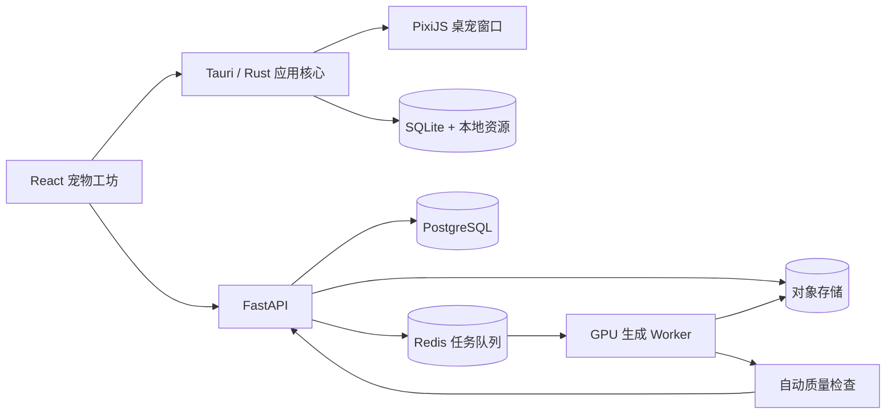

# Epet 桌面宠物产品与开发计划

> 文档版本：v0.1  
> 编写日期：2026-07-23  
> 当前状态：待评审  
> 首发目标：Windows 10/11  
> 推荐技术路线：Tauri 2 + React/TypeScript + PixiJS + Python/FastAPI + 云端 GPU

## 1. 项目目标

Epet 的核心目标是让用户通过一张或多张真实宠物照片，生成一个保留宠物主要外观特征、能够播放动画并长期显示在电脑桌面上的 2D 桌面宠物。

首版必须完成下面的完整闭环：

```text
打开软件
→ 上传宠物照片
→ 检查并裁剪照片
→ 生成标准宠物形象
→ 用户确认形象
→ 生成桌面动作
→ 预览
→ 点击“使用到桌面”
→ 宠物出现在桌面
→ 可拖动、互动、隐藏和重新唤出
```

项目不应把“生成一张好看的图片”当作最终结果。真正的交付物是一套可以被桌宠运行时加载的宠物资产，包括角色贴图、动作、锚点、碰撞区域、缩略图和资源清单。

## 2. 计划假设

为了让实施步骤足够明确，本计划先采用以下假设：

1. 首发只支持 Windows 10/11 x64，macOS 在 MVP 验证后处理。
2. 技术内测先只支持猫，公开 MVP 再扩展到猫和狗。
3. 首版只提供一种统一的卡通风格。
4. 同一时间只允许一只宠物显示在桌面。
5. 首版动作包括待机、走路、睡觉、点击反应和拖拽反应。
6. AI 生成在云端 GPU 上完成，客户端只负责照片预处理、上传、任务展示和宠物运行。
7. 首版不做自动 Live2D 和任意宠物 3D 建模，采用 Sprite Atlas、简单骨骼和形变模板。
8. 首版可以不要求用户注册账号，使用匿名安装 ID 和短期任务令牌；账号、云同步和付费在后续版本增加。
9. 以 3 人核心团队估算：1 名桌面端、1 名后端/AI、1 名产品设计兼测试。若由 1 人独立开发，时间需要相应延长。

如果上述假设改变，优先调整范围和时间，不应直接把额外需求塞入当前 MVP。

## 3. MVP 范围

### 3.1 必须实现

- 普通可视化主窗口。
- JPG、PNG、WebP 照片上传。
- 图片旋转、裁剪、压缩、EXIF 清理和质量检查。
- 单只宠物检测和主体选择。
- 一种风格的标准宠物形象生成。
- 标准形象确认和重新生成。
- 待机、走路、睡觉、点击、拖拽动作。
- 生成进度、失败原因和失败重试。
- 桌面宠物预览。
- 透明、无边框、置顶的桌宠窗口。
- 宠物拖动、缩放、隐藏、暂停和鼠标穿透模式。
- 系统托盘。
- 宠物资源本地保存和再次使用。
- 软件重启后恢复上次使用的宠物、位置和尺寸。
- 原始照片删除、保留期限说明和隐私设置。
- Windows 安装包、卸载和基础自动更新能力。

### 3.2 明确不进入首版

- 任意照片自动生成完整 Live2D 模型。
- 单张照片直接生成通用 3D 模型。
- 多只宠物同时在桌面活动。
- AI 对话、语音和复杂人格系统。
- 饥饿、健康、货币等复杂养成系统。
- 用户社区、宠物市场和创作者平台。
- 跨设备云同步。
- Linux 正式支持。
- 用户自定义脚本和第三方插件。

## 4. 成功标准

下面指标作为 MVP 的初始目标，完成技术验证后再根据实测调整：

### 4.1 产品指标

- 合格照片从上传到生成成功的比例不低于 85%。
- 生成成功后点击“使用到桌面”的比例不低于 70%。
- “上传 → 生成 → 使用到桌面”完整流程完成率不低于 65%。
- 生成结果的人工作用性评审通过率不低于 80%。
- 用户可以在不查看帮助文档的情况下完成首次生成。
- 次日仍启动桌宠的测试用户比例作为核心留存指标持续观察。

### 4.2 性能指标

- 参考电脑上冷启动主窗口不超过 3 秒。
- 宠物静止时客户端 CPU 平均占用目标低于 5%。
- 宠物运行时内存目标低于 250 MB。
- 动画正常情况下保持至少 30 FPS。
- 锁屏、睡眠、全屏应用或宠物长时间不可见时自动降帧或暂停。
- 单个宠物资源包建议控制在 30 MB 以内。

### 4.3 稳定性指标

- 无崩溃会话比例达到 99.5%。
- 网络中断后生成任务可以恢复查询，不重复扣减生成额度。
- 软件重启后不会丢失已经下载完成的宠物资源。
- 更新或卸载不会误删用户明确选择保留的宠物资源。

## 5. 产品形态和用户流程

### 5.1 软件由三个部分组成

1. **宠物工坊主窗口**
   - 上传、裁剪和检查照片。
   - 选择生成风格。
   - 展示生成进度和错误。
   - 预览宠物动作。
   - 管理已经生成的宠物。
   - 修改设置。

2. **桌面宠物窗口**
   - 透明、无边框、默认置顶。
   - 只加载宠物运行所需资源。
   - 负责动画、移动、拖动、点击互动和状态切换。
   - 主窗口关闭后仍可继续运行。

3. **系统托盘**
   - 打开宠物工坊。
   - 显示或隐藏宠物。
   - 切换交互模式和鼠标穿透模式。
   - 暂停动画。
   - 重置宠物位置。
   - 退出软件。

### 5.2 首次使用流程

1. 启动时显示简单介绍和照片要求。
2. 用户点击“创建宠物”。
3. 用户选择照片，客户端立即检查格式、尺寸和文件大小。
4. 客户端自动修正 EXIF 旋转并移除元数据。
5. 用户裁剪照片并确认宠物主体。
6. 系统检查是否只有一只宠物、主体是否完整、遮挡是否严重。
7. 不合格时给出具体原因，例如“尾巴被截断”或“照片过暗”，允许继续尝试或换图。
8. 用户确认隐私说明后上传。
9. 服务端生成一张标准角色立绘。
10. 用户确认立绘；如果不像，可以重试或更换照片。
11. 确认后生成动作资源。
12. 预览页依次播放待机、走路、睡觉和点击反应。
13. 用户设置名称和默认大小。
14. 用户点击“使用到桌面”。
15. 资源完整性校验通过后，桌宠窗口在当前屏幕右下区域显示宠物。
16. 主窗口隐藏到系统托盘。

### 5.3 失败恢复流程

- 上传失败：保留本地裁剪状态，允许继续上传。
- 任务排队：展示排队状态和预计阶段，不伪造百分比。
- 标准立绘失败：允许在不重新上传的情况下重试。
- 某个动作失败：只重新生成失败动作，不重复生成全部资源。
- 客户端退出：重启后根据任务 ID 恢复状态。
- 资源下载中断：支持断点续传或重新下载。
- 资源校验失败：删除损坏的临时文件并重新下载。
- 最终生成失败：保留明确错误码，并允许用户删除原始照片。

## 6. 总体技术架构



### 6.1 桌面端

- 使用 Tauri 2 管理应用生命周期、窗口、托盘、文件系统和更新。
- 使用 React + TypeScript 实现宠物工坊。
- 使用 PixiJS 实现 Sprite 渲染、动画播放和简单特效。
- 使用 Rust 处理窗口坐标、DPI、多显示器、开机启动和需要原生实现的命中测试。
- 使用 SQLite 保存宠物索引、设置和生成任务状态。
- 宠物大文件保存在应用数据目录，SQLite 只保存索引和元数据。

### 6.2 服务端

- FastAPI 提供上传、生成、确认、查询、重试和删除接口。
- PostgreSQL 保存任务、上传记录、生成版本和资源索引。
- Redis 保存异步队列和短期任务事件。
- 对象存储保存短期原图、中间产物和最终宠物包。
- GPU Worker 负责抠图、特征提取、标准立绘、动作关键帧、后处理和质量检查。
- 使用 SSE 推送任务状态；SSE 断开时客户端退回到轮询。

### 6.3 安全边界

- WebView 不直接获得任意文件系统权限，只通过定义明确的 Tauri Command 操作。
- 客户端不保存云端长期密钥。
- 上传和下载使用短期签名 URL。
- `.epet` 宠物包只允许 JSON、图片和音频等数据文件，禁止执行脚本。
- 解包时检查文件数量、总大小、扩展名、哈希和路径，拒绝绝对路径及 `../` 路径。
- 日志不得记录原始照片、签名 URL、访问令牌和用户输入的完整本地路径。

## 7. 推荐仓库结构

```text
Epet/
├── apps/
│   └── desktop/
│       ├── src/                    # React 主窗口和桌宠 WebView
│       ├── src-tauri/              # Rust、窗口、托盘、SQLite、更新
│       └── tests/
├── services/
│   ├── api/                        # FastAPI
│   └── worker/                     # AI 和资产处理 Worker
├── packages/
│   ├── contracts/                  # OpenAPI、JSON Schema、共享类型
│   ├── pet-runtime/                # 动画状态机和资源加载器
│   └── ui/                         # 可复用 UI 组件
├── assets/
│   ├── builtin-pet/                # 内置测试宠物
│   └── templates/                  # 动作、骨骼、姿态和打包模板
├── infra/
│   ├── docker/
│   └── deployment/
├── tests/
│   ├── fixtures/                   # 已脱敏测试照片
│   ├── contract/
│   └── e2e/
├── docs/
│   ├── architecture/
│   ├── privacy/
│   └── runbooks/
├── PLAN.md
└── README.md
```

根目录使用统一命令封装开发流程，例如：

- `dev:desktop`：启动桌面端。
- `dev:api`：启动 API。
- `dev:worker`：启动 Worker。
- `test`：运行不依赖 GPU 的全部测试。
- `test:e2e`：运行端到端测试。
- `lint`：检查 TypeScript、Rust 和 Python。
- `build:desktop`：构建 Windows 安装包。

## 8. 核心数据结构

### 8.1 宠物资源包

最终资源使用 `.epet` 扩展名，本质为受限制的压缩包。建议结构：

```text
pet.epet
├── manifest.json
├── thumbnail.webp
├── atlas/
│   ├── pet.webp
│   └── pet.json
├── audio/
└── license.json
```

`manifest.json` 示例：

```json
{
  "schema_version": 1,
  "pet_id": "pet_01J...",
  "name": "Mimi",
  "species": "cat",
  "renderer": "sprite_atlas",
  "canvas": { "width": 512, "height": 512 },
  "default_scale": 0.75,
  "anchors": {
    "foot": [0.5, 0.92],
    "drag": [0.5, 0.35]
  },
  "hitboxes": [
    { "id": "body", "shape": "ellipse", "x": 0.18, "y": 0.2, "w": 0.64, "h": 0.7 }
  ],
  "actions": {
    "idle": { "animation": "idle", "fps": 15, "loop": true },
    "walk": { "animation": "walk", "fps": 18, "loop": true },
    "sleep": { "animation": "sleep", "fps": 12, "loop": true },
    "tap": { "animation": "tap", "fps": 18, "loop": false },
    "drag": { "animation": "drag", "fps": 15, "loop": true }
  },
  "generation": {
    "pipeline_version": "1.0.0",
    "template_version": "cat-a-1"
  },
  "files": [
    { "path": "atlas/pet.webp", "sha256": "..." }
  ]
}
```

坐标统一使用 0 到 1 的归一化坐标，避免资源分辨率变化后锚点失效。

### 8.2 本地数据库

首版至少包含以下表：

- `pets`
  - `id`
  - `name`
  - `species`
  - `thumbnail_path`
  - `package_path`
  - `package_hash`
  - `created_at`
  - `last_used_at`
  - `status`
- `generation_jobs`
  - `id`
  - `remote_job_id`
  - `stage`
  - `progress`
  - `error_code`
  - `last_event_id`
  - `created_at`
  - `updated_at`
- `app_settings`
  - `key`
  - `value`
- `runtime_state`
  - `active_pet_id`
  - `monitor_id`
  - `x`
  - `y`
  - `scale`
  - `visible`
  - `click_through`

数据库迁移必须带版本号；升级失败时保留旧数据库并给出可恢复错误，不直接重建。

### 8.3 服务端任务状态

生成任务使用明确的状态机：

```text
created
→ uploading
→ validating
→ generating_portrait
→ awaiting_portrait_confirmation
→ generating_actions
→ postprocessing
→ quality_check
→ packaging
→ ready
```

所有处理中状态都允许进入：

```text
failed / canceled / expired
```

每次状态变化记录阶段、时间、版本、错误码和是否可重试。客户端只根据状态机展示 UI，不根据文案猜测任务状态。

## 9. API 计划

### 9.1 上传

- `POST /v1/uploads`
  - 创建上传会话。
  - 返回上传 ID、短期签名 URL、文件限制和过期时间。
- `POST /v1/uploads/{upload_id}/complete`
  - 通知服务端上传完成。
  - 服务端重新验证 MIME、尺寸、哈希和实际文件内容。
- `DELETE /v1/uploads/{upload_id}`
  - 删除原图和未完成的中间文件。

### 9.2 生成

- `POST /v1/generations`
  - 参数：上传 ID、风格 ID、物种提示、客户端幂等键。
  - 返回生成任务 ID。
- `GET /v1/generations/{job_id}`
  - 查询当前状态、阶段进度、可恢复错误和预览地址。
- `GET /v1/generations/{job_id}/events`
  - SSE 任务事件流。
- `POST /v1/generations/{job_id}/portrait/confirm`
  - 确认标准立绘并启动动作生成。
- `POST /v1/generations/{job_id}/portrait/regenerate`
  - 使用原照片重新生成标准立绘。
- `POST /v1/generations/{job_id}/actions/{action}/regenerate`
  - 只重做某个动作。
- `POST /v1/generations/{job_id}/cancel`
  - 尝试取消尚未执行或可安全停止的任务。
- `GET /v1/generations/{job_id}/artifact`
  - 返回短期签名下载地址、包大小和 SHA-256。
- `DELETE /v1/generations/{job_id}`
  - 删除任务及按策略允许删除的相关资源。

### 9.3 API 实现要求

- 创建和重试接口使用幂等键，防止网络重试重复创建收费任务。
- 错误返回稳定的机器错误码和可本地化的展示参数。
- 所有列表和事件接口支持版本字段。
- 下载前后都校验哈希。
- 限制每个匿名安装 ID 的并发任务数和每日生成次数。
- API、客户端和 Worker 共享同一份 OpenAPI/JSON Schema 契约。

## 10. 分阶段实施计划

整体按 14 周左右的三人团队 MVP 规划。桌面端和 AI 服务可以并行，时间是估算，不是上线承诺。

| 阶段 | 建议时间 | 核心结果 |
|---|---:|---|
| 阶段 0：关键技术验证 | 第 1 周 | 证明桌宠窗口和生成一致性可行 |
| 阶段 1：工程基础 | 第 2 周 | 仓库、CI、契约和开发环境可用 |
| 阶段 2：桌面壳 | 第 2–4 周 | 内置宠物可以稳定显示在桌面 |
| 阶段 3：宠物运行时 | 第 3–5 周 | 动画、状态、拖拽和资源包可用 |
| 阶段 4：宠物工坊 UI | 第 4–6 周 | 上传、进度、预览和宠物库可用 |
| 阶段 5：生成服务基础 | 第 4–7 周 | API、队列、存储和 Worker 可用 |
| 阶段 6：AI 资产流水线 | 第 6–10 周 | 照片可以稳定生成可运行宠物包 |
| 阶段 7：端到端集成 | 第 10–11 周 | 完整用户闭环打通 |
| 阶段 8：测试和加固 | 第 11–13 周 | 性能、兼容、安全达到发布门槛 |
| 阶段 9：小范围发布 | 第 14 周 | 签名安装包和灰度版本上线 |

### 阶段 0：关键技术验证

#### 目标

在大规模开发前验证两个最高风险问题：

1. Windows 透明桌宠窗口是否能稳定置顶、拖动和穿透。
2. 同一只宠物能否生成外观一致的标准立绘和多个动作。

#### 步骤 0.1：桌宠窗口 Spike

要做什么：

- 创建最小 Tauri 2 应用。
- 创建一个普通窗口和一个透明桌宠窗口。
- 使用一张内置透明 PNG 或简单 Sprite 动画。
- 验证无边框、置顶、跳过任务栏、显示和隐藏。
- 验证主窗口关闭后托盘和桌宠仍然运行。

怎么做：

- 桌宠窗口先采用紧贴宠物尺寸的小窗口，降低透明区域阻挡鼠标的问题。
- 用 Tauri 窗口 API 实现置顶、位置和可见性。
- 用托盘菜单实现“显示宠物”“隐藏宠物”“退出”。
- 记录窗口坐标时同时记录显示器 ID 和 DPI 缩放。

验收标准：

- Windows 10 和 Windows 11 上可以连续运行 2 小时。
- 桌宠不出现在任务栏和 Alt-Tab 主列表中。
- 主窗口关闭后桌宠不退出。
- 拖动后位置可以持久化。
- 重启后宠物回到有效屏幕区域。

#### 步骤 0.2：鼠标交互 Spike

要做什么：

- 验证可交互模式和完全穿透模式。
- 验证透明像素区域是否会阻挡下面的窗口。
- 评估是否需要 Windows 原生命中测试。

怎么做：

- 基线方案使用 Tauri 的忽略鼠标事件能力切换整个桌宠窗口。
- 可交互模式下缩小窗口边界，使阻挡区域尽量接近宠物。
- 如果透明边角仍明显影响使用，实现 Windows `WM_NCHITTEST` 原生处理：碰撞区域外返回穿透，宠物碰撞区域内允许点击。
- 不使用未文档化的 WorkerW“塞进桌面图标层”方案。

验收标准：

- 用户可以从托盘切换交互和穿透。
- 穿透模式下可以正常点击宠物后方的窗口。
- 可交互模式下可以点击和拖动宠物。
- 模式切换不会造成窗口失焦、卡死或丢失位置。

#### 步骤 0.3：AI 一致性 Spike

要做什么：

- 准备至少 20 组已获授权的猫照片。
- 从每张照片生成标准立绘，以及待机、走路、睡觉三个动作的关键帧。
- 评估脸部、花纹、体型、尾巴和耳朵的一致性。

怎么做：

- 固定一种风格、分辨率和背景。
- 先生成标准角色图，再以它作为所有动作的唯一身份参考。
- 使用固定姿态模板控制动作轮廓。
- 不独立生成动画的每一帧，只生成关键姿态，然后使用骨骼、网格形变或插值补足中间帧。
- 建立人工评分表，同时保留自动相似度和闪烁指标作为辅助。

验收标准：

- 至少 80% 的样例能产出可辨认是同一只宠物的三个动作。
- 动作间主色、主要花纹、耳型和尾型没有明显随机变化。
- 如果达不到门槛，MVP 自动降级为“标准立绘抠图 + 模板轻动画”，不阻塞桌面端发布。

#### 阶段出口

- 完成窗口技术记录和兼容性结果。
- 完成 AI 样例集、评分表和失败案例分类。
- 明确采用小窗口还是全屏 Overlay。
- 明确首版使用生成动作还是模板动作。

### 阶段 1：工程基础

#### 步骤 1.1：初始化仓库

要做什么：

- 建立前述目录结构。
- 配置 Node、Rust 和 Python 版本。
- 添加格式化、静态检查、单元测试和提交检查。

怎么做：

- 前端使用统一的包管理器和锁文件。
- Python 使用锁定依赖的环境工具。
- Rust 提交 `Cargo.lock`。
- 提供 `.env.example`，真实密钥不进入仓库。
- README 写明 Windows 开发环境和一键启动方式。

验收标准：

- 新开发者按照 README 可在 30 分钟内启动桌面端和本地 API。
- 所有基础检查可以通过一个统一命令执行。
- 仓库不包含密钥、真实用户照片和大模型权重。

#### 步骤 1.2：建立 CI

要做什么：

- 每次提交运行 TypeScript、Rust、Python 的格式检查和测试。
- 构建不签名的 Windows 测试包。
- 生成测试报告和构建产物。

怎么做：

- 将快速检查和耗时测试分开。
- GPU 测试不放在普通 PR 流程中，改用每日或手动任务。
- 固定工具链版本，避免构建机器漂移。

验收标准：

- 干净检出可以重复构建。
- 任一语言的类型错误或测试失败都会阻止合并。
- 构建产物能够在干净的 Windows 测试机安装。

#### 步骤 1.3：定义共享契约

要做什么：

- 定义宠物包 Schema、任务状态、错误码和 API。
- 生成 TypeScript 和 Python 类型。

怎么做：

- API 以 OpenAPI 为事实来源。
- 宠物包使用单独 JSON Schema 并包含 `schema_version`。
- 所有破坏性变更必须提升版本并提供迁移策略。

验收标准：

- 客户端、API 和 Worker 的契约测试通过。
- 无法通过 Schema 的宠物包不能进入本地宠物库。

### 阶段 2：桌面壳

#### 步骤 2.1：多窗口和生命周期

要做什么：

- 实现主窗口、桌宠窗口和系统托盘。
- 定义关闭、隐藏、退出和再次打开的行为。

怎么做：

- 关闭主窗口默认隐藏到托盘，不结束后台进程。
- “退出”必须从托盘或设置中明确触发。
- 桌宠窗口崩溃时可单独重建，不要求重启整个应用。
- 使用单实例锁，第二次启动只唤醒已有主窗口。

验收标准：

- 重复启动不会出现多个托盘和多个宠物。
- 主窗口可以反复打开和关闭。
- 桌宠窗口异常销毁后能恢复。

#### 步骤 2.2：窗口位置和多显示器

要做什么：

- 获取所有显示器的工作区、DPI 和主屏信息。
- 保存并恢复宠物的位置。
- 处理显示器拔出、分辨率变化和 DPI 变化。

怎么做：

- 坐标以物理像素保存，同时记录当时的显示器标识和缩放比例。
- 恢复时先检查目标显示器是否存在。
- 如果位置不可见，将宠物移动到当前主屏右下安全区域。
- 移动范围使用工作区，不覆盖任务栏。

验收标准：

- 100%、125%、150%、200% 缩放下位置正确。
- 双屏左右排列和上下排列下都能拖动。
- 拔掉外接显示器后宠物不会留在不可见区域。

#### 步骤 2.3：托盘和运行设置

要做什么：

- 添加打开工坊、显示/隐藏、穿透、暂停、重置位置、开机启动和退出。

怎么做：

- 菜单状态与实际运行状态双向同步。
- 开机启动默认关闭，由用户主动开启。
- 暂停后停止动画计时器和自主移动，保留当前画面。

验收标准：

- 所有托盘操作在主窗口关闭时仍可用。
- 开机启动设置可撤销。
- 退出后无残留进程。

### 阶段 3：宠物运行时

#### 步骤 3.1：安全资源加载器

要做什么：

- 下载、校验、解包和加载 `.epet`。
- 处理版本不兼容、文件缺失和资源损坏。

怎么做：

- 先下载到临时目录。
- 校验总大小、SHA-256 和清单。
- 使用随机临时目录安全解包。
- 校验所有资源后再原子移动到正式目录。
- 失败时删除临时文件，不破坏已有版本。

验收标准：

- 修改任意资源字节后校验会失败。
- 路径穿越和超大压缩包测试会被拒绝。
- 更新宠物资源失败时仍可使用旧版本。

#### 步骤 3.2：PixiJS 渲染器

要做什么：

- 加载 Sprite Atlas。
- 播放循环和非循环动作。
- 支持缩放、翻转、透明度和简单阴影。

怎么做：

- 纹理只加载一次并复用。
- 左右行走优先水平翻转，不重复生成资源；不对称花纹在生成 QA 中单独检查。
- 所有动作共用脚底锚点，切换时保持落脚位置不跳动。
- 静止和遮挡时降低渲染频率。

验收标准：

- 动作切换无明显闪烁。
- 脚底位置稳定。
- 连续切换 500 次不产生明显内存增长。

#### 步骤 3.3：行为状态机

建议状态：

```text
boot → idle ↔ walk → idle
             ↘ sleep
any → tap → idle
any → drag → drop → idle
any → paused
```

怎么做：

- 动作优先级为：拖拽 > 点击反应 > 系统暂停 > 睡觉 > 走路 > 待机。
- 随机行为使用可配置时间范围，避免频繁打扰。
- 状态切换只由状态机负责，UI 和输入层发送事件，不直接播放动画。
- 保存可复现的调试随机种子，方便复现行为 Bug。

验收标准：

- 不会出现拖拽中突然睡觉等非法切换。
- 每个状态都有超时和异常恢复路径。
- 状态机单元测试覆盖全部合法和非法转换。

#### 步骤 3.4：交互

要做什么：

- 点击反应、拖拽、右键菜单、滚轮缩放和穿透切换。

怎么做：

- 使用 manifest 中的碰撞区域判断是否点击到宠物。
- 拖拽过程中暂停自主移动。
- 松开时限制位置到当前工作区。
- 缩放设置最小值和最大值，并持久化。
- 提供全局快捷键作为“穿透后无法点击宠物”的恢复入口。

验收标准：

- 快速点击、拖动、缩放不会导致宠物丢失。
- 穿透模式始终可以通过托盘或快捷键关闭。
- 右键菜单不会意外触发拖拽。

### 阶段 4：宠物工坊 UI

#### 步骤 4.1：页面和状态设计

实现以下页面：

- 首页 / 我的宠物。
- 创建宠物。
- 照片裁剪和质量检查。
- 生成进度。
- 标准立绘确认。
- 动作预览。
- 宠物详情。
- 设置和隐私。

怎么做：

- 任务状态保存在本地数据库，不只存在 React 内存中。
- 页面刷新或软件重启后从本地和服务端恢复任务。
- 所有不可逆操作，例如删除宠物，要求明确确认。

验收标准：

- 任意生成阶段退出主窗口后都能恢复。
- 页面不会因网络短暂中断丢失任务。

#### 步骤 4.2：本地照片处理

要做什么：

- 格式验证、旋转、裁剪、尺寸压缩和 EXIF 清理。

怎么做：

- 解码图片内容，不只检查扩展名。
- 限制输入尺寸和文件大小。
- 默认最长边压缩到生成服务需要的尺寸。
- 上传前展示最终裁剪结果和预计上传大小。
- 临时文件在任务完成、取消或过期后清理。

验收标准：

- 超大图、损坏图、伪装扩展名和透明空图都有明确错误。
- 上传文件不包含 GPS 等 EXIF 信息。
- 裁剪后的方向与用户看到的一致。

#### 步骤 4.3：进度和预览

要做什么：

- 展示真实阶段：检查、排队、标准形象、等待确认、动作生成、打包。
- 展示可操作的失败信息。
- 播放最终动作预览。

怎么做：

- 使用 SSE 接收事件，并记录最后事件 ID。
- 断线后携带最后事件 ID 恢复；失败则改用低频轮询。
- 百分比只在服务端有真实子任务进度时显示，否则使用阶段状态。
- 预览使用与桌宠窗口相同的 `pet-runtime`，避免预览与桌面结果不一致。

验收标准：

- 断网 2 分钟后恢复，任务状态能够继续更新。
- 每一种服务端错误都有对应用户操作。
- 预览通过的资源可以直接被桌宠运行时加载。

#### 步骤 4.4：我的宠物

要做什么：

- 展示缩略图、名称、创建时间和当前使用状态。
- 支持使用、隐藏、重命名、删除和重新下载。

怎么做：

- 删除本地资源和删除云端任务分成两个明确选项。
- 删除正在使用的宠物前先停止桌宠。
- 资源丢失时显示“重新下载”，不显示为普通可用状态。

验收标准：

- 删除不会影响其他宠物。
- 当前宠物状态在主窗口、托盘和桌宠窗口中一致。

### 阶段 5：生成服务基础

#### 步骤 5.1：API、数据库和对象存储

要做什么：

- 实现上传、任务、事件、确认、重试、下载和删除接口。
- 建立 PostgreSQL 数据模型和迁移。

怎么做：

- 所有资源归属匿名安装 ID 或用户 ID。
- 数据库只保存对象键，不保存长期签名 URL。
- 上传对象、处理中间对象和最终对象使用不同前缀和保留策略。
- 删除操作记录审计事件，但审计日志不保留图片内容。

验收标准：

- 用户 A 无法访问用户 B 的任务和资源。
- 重复提交同一幂等键只创建一个任务。
- 过期签名 URL 无法继续访问。

#### 步骤 5.2：异步队列

要做什么：

- 将生成拆为可重试的独立步骤。
- 支持取消、超时、重试和死信队列。

怎么做：

- 每一步输入和输出都保存版本和对象键。
- 重试从失败步骤继续，不重复已成功且仍有效的步骤。
- 对模型超时、显存不足、输入不合格和内部错误使用不同策略。
- 单个任务设置最大自动重试次数和最大 GPU 时间。

验收标准：

- Worker 崩溃后任务能够被其他 Worker 接管。
- 同一步骤重复执行不会覆盖已确认的用户结果。
- 超过重试次数的任务进入可诊断的失败状态。

#### 步骤 5.3：事件和可观测性

要做什么：

- 记录阶段耗时、队列时间、GPU 时间、失败原因和成本。
- 提供 SSE 事件。

怎么做：

- 每个任务使用统一关联 ID。
- 日志、指标和追踪都携带任务 ID，但不携带原始照片。
- 统计每次成功生成的 GPU 秒数、存储和流量成本。
- 为队列积压、失败率和 GPU 不可用设置告警。

验收标准：

- 可以从任务 ID 定位失败步骤和模型版本。
- 可以计算每个成功宠物的平均生成成本。
- SSE 断开不会影响后台任务执行。

### 阶段 6：AI 资产流水线

#### 步骤 6.1：照片质量门禁

要做什么：

- 检测宠物数量、主体面积、清晰度、亮度、遮挡和身体完整度。

怎么做：

- 先做通用图像检查，再做宠物检测和分割。
- 输出结构化结果，不只输出“合格/不合格”。
- 对可修复问题给出裁剪建议，对不可修复问题要求换图。
- 技术内测允许人工覆盖门禁，公开版本默认不允许明显不合格输入消耗 GPU。

验收标准：

- 测试集中明显模糊、主体过小、多人多宠物和严重截断样例能被识别。
- 误拒绝和误放行率有记录，并可按模型版本比较。

#### 步骤 6.2：抠图和宠物特征描述

要做什么：

- 生成干净的宠物 Alpha Mask。
- 提取可用于控制后续生成的 `pet_spec`。

`pet_spec` 至少包含：

- 物种和体型。
- 毛色主色和辅色。
- 主要花纹及位置。
- 耳型。
- 眼睛颜色。
- 鼻口特征。
- 尾巴长度和形态。
- 毛发长短。
- 可见饰品。
- 不确定或被遮挡的部位。

怎么做：

- 检测和分割结果保留置信度。
- Alpha 边缘使用毛发修边，避免白边和硬锯齿。
- 结构化特征和参考图共同输入生成模型，不只依赖文字描述。
- 被遮挡部位标记为“推断”，在 UI 中说明可能与真实宠物不同。

验收标准：

- 测试照片在浅色和深色背景下均无明显背景残留。
- 主要毛色、耳型和花纹描述与人工标注基本一致。

#### 步骤 6.3：生成标准角色立绘

要做什么：

- 生成统一构图、统一姿势、透明或纯色背景的标准角色图。

怎么做：

- 使用固定画布、镜头、光线、风格和标准姿势。
- 将原照片、抠图结果、`pet_spec` 和风格模板作为条件。
- 保存模型版本、工作流版本和随机种子。
- 一次可以生成少量候选，但只让用户确认一个主版本。
- 用户确认后冻结身份参考，后续动作不得自行改变身份源。

验收标准：

- 角色完整落在画布内。
- 没有多余肢体、严重残缺或背景污染。
- 人工评审能够从候选中识别原宠物的主要特征。

#### 步骤 6.4：动作模板和关键帧

要做什么：

- 为每种体型定义固定动作模板。
- 生成待机、走路、睡觉、点击和拖拽动作。

怎么做：

- 先建立少量体型原型，例如短毛猫 A、长毛猫 B、小型犬 A、中型犬 B。
- 每个模板定义画布、脚底线、身体关键点、动作关键姿态和碰撞区域。
- 使用已确认标准立绘作为身份参考，使用姿态图或轮廓作为动作约束。
- 只生成动作关键帧，采用骨骼、网格形变或受控插值生成中间帧。
- 待机动作优先使用呼吸、眨眼、尾巴摆动等局部变化，降低身份漂移。
- 走路动作要求脚底基线和循环首尾一致。

验收标准：

- 五种动作都可在统一画布和锚点下播放。
- 动作间脸型、毛色、花纹和身体比例无明显跳变。
- 动画循环首尾没有明显闪帧。

#### 步骤 6.5：后处理

要做什么：

- 统一透明边缘、色彩、尺寸、锚点、碰撞区域和帧率。
- 打包 Sprite Atlas。

怎么做：

- 对每帧执行 Alpha 修边、去背景色污染和边缘颜色扩展。
- 计算统一包围盒，并按模板对齐脚底锚点。
- 限制纹理最大尺寸，优先使用支持 Alpha 的 WebP 或 PNG。
- 合并图集时保留帧名、时长和动作标签。
- 生成缩略图、manifest、license 和文件哈希。

验收标准：

- 资源可以通过 JSON Schema 和桌宠资源加载器校验。
- 透明边缘在浅色和深色桌面上都没有明显光边。
- 资源包大小和纹理尺寸不超过配置限制。

#### 步骤 6.6：自动质量检查

检查项：

- 宠物身份相似度。
- 主要颜色和花纹漂移。
- 多肢体、缺肢体和轮廓破损。
- 动画闪烁。
- 循环接缝。
- 脚底滑动。
- 透明背景污染。
- 文件完整性。

怎么做：

- 自动检查作为筛选，不完全替代人工和用户预览。
- 为每项输出分数、阈值和失败原因。
- 失败时只重做对应动作或对应后处理步骤。
- 保存失败缩略图供开发排查，按隐私保留策略自动删除。

验收标准：

- 已知坏样例能够被稳定拦截。
- 质量检查不会无限重试。
- 用户看到的动作均已通过最低质量门槛。

### 阶段 7：端到端集成

#### 步骤 7.1：打通完整闭环

按真实用户路径执行：

1. 创建上传会话。
2. 本地处理照片。
3. 上传照片。
4. 创建生成任务。
5. 接收任务事件。
6. 确认标准立绘。
7. 等待动作和打包。
8. 下载 `.epet`。
9. 校验并加入宠物库。
10. 点击“使用到桌面”。
11. 桌宠窗口加载资源。

怎么做：

- 使用统一关联 ID 串起客户端日志、API 日志和 Worker 日志。
- 每一步都支持重复进入和幂等恢复。
- 只有宠物包完整校验并入库后才显示“使用到桌面”。

验收标准：

- 20 次连续测试中至少 18 次无需人工干预完成完整流程。
- 在上传、生成、下载各阶段强制断网后都能恢复或明确失败。
- 重启客户端不会创建重复宠物或重复任务。

#### 步骤 7.2：删除和隐私闭环

要做什么：

- 支持删除本地照片、临时文件、宠物资源和云端任务。
- 落实保留期限。

怎么做：

- 原始照片默认在生成完成或任务终止后 24 小时内自动删除。
- 用户主动删除时立即使访问令牌失效，并异步清理对象。
- 默认不使用用户照片训练模型；未来如需使用必须单独明确授权。
- UI 展示“本地删除”和“云端删除”的区别。

验收标准：

- 删除请求可查询完成状态。
- 保留策略有自动任务和监控。
- 隐私文档与实际系统行为一致。

### 阶段 8：测试和加固

#### 步骤 8.1：自动化测试

- 单元测试
  - 状态机。
  - 坐标和 DPI 转换。
  - manifest 解析。
  - 错误码映射。
  - AI 后处理函数。
- 契约测试
  - OpenAPI。
  - JSON Schema。
  - SSE 事件版本。
- 集成测试
  - SQLite 迁移。
  - 上传和下载。
  - Redis 重试。
  - 对象删除。
- 端到端测试
  - 上传到使用桌面。
  - 网络断开恢复。
  - 软件重启恢复。
  - 资源损坏恢复。

验收标准：

- 核心状态机和安全解包逻辑达到高覆盖。
- 每个已修复严重 Bug 至少增加一个回归测试。
- 发布分支所有非 GPU 自动化测试通过。

#### 步骤 8.2：Windows 兼容矩阵

至少覆盖：

- Windows 10 最新受支持版本。
- Windows 11 当前受支持版本。
- 100%、125%、150%、200% DPI。
- 单屏、双屏和显示器热插拔。
- 集成显卡和独立显卡。
- 睡眠、唤醒、锁屏、切换用户。
- 全屏游戏或视频。
- 资源管理器重启。
- 安装、覆盖升级和卸载。

验收标准：

- 没有宠物永久跑到屏幕外。
- 没有窗口持续抢焦点。
- 不影响任务栏、输入法和常用办公软件点击。
- 睡眠唤醒后动画和托盘恢复。

#### 步骤 8.3：性能和稳定性

怎么做：

- 对空闲、待机、走路、拖拽和主窗口打开分别采样 CPU、内存和 GPU。
- 运行 8 小时稳定性测试。
- 模拟资源反复切换和窗口反复创建。
- 检查纹理、事件监听器、计时器和 WebView 是否泄漏。
- 全屏或锁屏时暂停不必要工作。

验收标准：

- 达到第 4 节性能目标，或记录经过批准的新基线。
- 8 小时运行没有持续内存上升。
- 客户端异常退出后可以生成脱敏崩溃报告。

#### 步骤 8.4：安全检查

检查项：

- 文件类型伪装。
- 压缩炸弹。
- Zip Slip。
- 未授权任务访问。
- 签名 URL 泄露。
- 日志敏感信息。
- Tauri Command 权限过宽。
- WebView 内容注入。
- 依赖漏洞。
- 更新包签名。

验收标准：

- 高危问题全部关闭。
- 权限列表经过人工复核。
- 桌面端只加载本地受信内容，不加载任意远程网页。

### 阶段 9：小范围发布

#### 步骤 9.1：发布准备

要做什么：

- 申请 Windows 代码签名证书。
- 制作安装包、卸载程序和更新清单。
- 编写隐私政策、用户协议、照片要求和故障帮助。
- 建立版本号和发布说明规则。

怎么做：

- 发布包、更新包和清单都进行签名。
- 自动更新先进入灰度渠道，再进入稳定渠道。
- 安装包上传前在干净虚拟机测试。
- 卸载时询问是否保留本地宠物资源。

验收标准：

- 干净 Windows 机器可安装、启动、升级和卸载。
- 签名可验证。
- 更新失败不会破坏当前可运行版本。

#### 步骤 9.2：封闭测试

建议先邀请 20–50 名用户，覆盖不同硬件和宠物照片。

观察指标：

- 上传合格率。
- 各生成阶段成功率和耗时。
- 用户在标准立绘阶段的重试次数。
- 每个动作的失败率。
- 下载和“使用到桌面”成功率。
- 客户端 CPU、内存、崩溃和窗口问题。
- 用户次日是否继续运行桌宠。

怎么做：

- 每周归类失败样例，区分输入问题、模型问题、后处理问题和客户端问题。
- 高成本重试前先优化失败最多的步骤。
- 仅收集完成产品改进所必需的脱敏数据。

发布门槛：

- 无阻塞使用的 P0 Bug。
- P1 Bug 有明确规避方案和修复时间。
- 关键成功指标达到目标或已有经评审的调整结论。
- 隐私删除流程经过真实验证。

## 11. 测试数据集计划

必须建立合法、可重复使用的内部测试集，不能依赖开发者临时从网络下载的未知授权图片。

建议第一阶段包含至少 100 组照片：

- 短毛猫、长毛猫。
- 浅色、深色、纯色和复杂花纹。
- 正面、侧面和轻微俯视。
- 简单背景和复杂背景。
- 不同光线和清晰度。
- 带项圈和不带项圈。
- 合格照片和故意准备的不合格照片。

每组数据包含：

- 使用授权记录。
- 宠物主体 Mask 或人工检查结果。
- 主要特征标注。
- 输入质量标签。
- 预期通过或拒绝原因。
- 每个流水线版本的输出和评分。

测试集不得进入客户端安装包，也不得用于生产日志展示。

## 12. 监控和埋点

### 12.1 客户端事件

- `app_started`
- `create_pet_started`
- `photo_selected`
- `photo_validation_failed`
- `upload_completed`
- `portrait_ready`
- `portrait_confirmed`
- `generation_failed`
- `pet_package_downloaded`
- `pet_activated`
- `pet_hidden`
- `click_through_changed`
- `client_crashed`

事件只包含必要的版本、阶段、错误码和性能数据，不包含照片、宠物名称和完整文件路径。

### 12.2 服务端指标

- API 成功率和延迟。
- 上传失败率。
- 各任务阶段队列时间和执行时间。
- 各模型版本成功率。
- 自动重试次数。
- GPU 利用率和显存错误。
- 每个成功宠物的 GPU 成本。
- 原图和临时对象删除积压。
- SSE 连接数和断开率。

### 12.3 告警

- 生成失败率突然升高。
- 队列等待超过阈值。
- GPU Worker 全部不可用。
- 删除任务积压。
- 对象存储或数据库错误。
- 新版本客户端崩溃率升高。

## 13. 主要风险和降级方案

| 风险 | 早期信号 | 处理方式 | 降级方案 |
|---|---|---|---|
| 跨动作不像同一只宠物 | 花纹、脸型变化明显 | 标准立绘冻结身份、固定姿态、关键帧生成 | 只用标准立绘做模板轻动画 |
| 单张照片遮挡严重 | 尾巴、四肢无法判断 | 上传质量门禁，引导增加侧面照 | 明确标注隐藏部分为 AI 推断 |
| 透明窗口挡鼠标 | 用户无法点击后方软件 | 小窗口、碰撞区域、原生命中测试 | 提供完全穿透和全局快捷键 |
| 多屏和 DPI 错位 | 宠物跑到屏幕外 | 使用工作区和显示器感知坐标 | 重置到主屏安全位置 |
| 生成太慢或太贵 | 队列长、重试多 | 分阶段缓存、局部重做、限制重试 | 降低动作数或使用模板动作 |
| GPU 服务不可用 | 任务大量积压 | 多 Worker、超时和告警 | 暂停新任务并保留已上传状态 |
| 用户照片隐私争议 | 删除不及时、说明不清 | 最小化存储、短期保留、可验证删除 | 暂停上传功能直到修复 |
| 安装包被安全软件误报 | 下载或安装被拦截 | 代码签名、稳定更新源、减少高风险行为 | 提供已签名离线安装包 |
| Live2D/动作库授权问题 | 商用条款不明确 | 上线前完成许可审查 | 使用自研 Sprite 运行时和自有模板 |
| 常驻资源占用过高 | 风扇转、耗电明显 | 降帧、暂停、限制纹理 | 提供静态模式 |

## 14. 团队分工

### 桌面端负责人

- Tauri、Rust 和 Windows 窗口行为。
- React 宠物工坊。
- PixiJS 运行时。
- 本地数据库和资源管理。
- 安装、签名和自动更新。

### 后端/AI 负责人

- FastAPI、PostgreSQL、Redis 和对象存储。
- GPU Worker 和流水线。
- 模型适配、后处理和 QA。
- 隐私删除任务。
- 服务端监控和成本。

### 产品设计/测试负责人

- 用户流程和 UI。
- 照片上传规则及错误文案。
- 测试集授权和标注。
- 生成结果人工评分。
- Windows 兼容测试。
- 封闭测试反馈和发布验收。

所有权不能只写“团队”。每个里程碑开始前，要为交付物、代码审查、验收和线上值守指定具体负责人。

## 15. Definition of Done

任何任务只有同时满足下列条件才算完成：

- 功能代码已合并。
- 有必要的单元测试或集成测试。
- 错误状态和恢复路径已实现。
- 日志不包含敏感信息。
- 文档和契约已同步更新。
- 已在目标 Windows 环境手工验证。
- 性能没有明显回退。
- 对用户可见的文案已经评审。
- 监控能够发现该功能的主要失败。

## 16. 前两周可直接执行的任务清单

### 第 1–2 天

- [ ] 确认首发只支持 Windows。
- [ ] 确认技术内测先只支持猫。
- [ ] 确认唯一首发画风。
- [ ] 确认默认照片保留期限。
- [ ] 初始化仓库、工具链和 README。
- [ ] 创建基础 CI。

### 第 3–5 天

- [ ] 创建 Tauri 主窗口和透明桌宠窗口。
- [ ] 加入内置测试宠物。
- [ ] 完成置顶、隐藏和退出。
- [ ] 创建系统托盘。
- [ ] 完成基础拖拽和位置保存。
- [ ] 在 Windows 10/11、不同 DPI 下测试。

### 第 6–7 天

- [ ] 实现交互和完全穿透切换。
- [ ] 评估透明区域原生命中测试。
- [ ] 实现单实例和主窗口隐藏到托盘。
- [ ] 记录桌宠窗口技术决策。

### 第 8–10 天

- [ ] 准备合法的 20 组 AI Spike 照片。
- [ ] 定义统一标准立绘和三个动作姿态。
- [ ] 跑第一轮标准立绘和动作生成。
- [ ] 建立身份一致性评分表。
- [ ] 确定生成动作或模板轻动画的 MVP 决策。
- [ ] 确认后续 12 周范围、人员和预算。

第一阶段最重要的交付不是漂亮的 UI，而是两个可以被验证的结果：

1. 内置宠物可以稳定显示在 Windows 桌面，并且不妨碍正常使用电脑。
2. 同一只真实宠物可以稳定地产出一张标准形象，并以可接受的一致性生成至少三个动作。

只有这两点验证通过，才进入完整产品开发。

## 17. MVP 之后的迭代顺序

### v1.1

- 更多猫狗体型模板。
- 多种画风。
- 多显示器行为增强。
- 喂食、抚摸和简单亲密度。
- 单个动作重新生成。
- macOS 技术预览。

### v1.2

- 多宠物切换。
- 配饰和动作包。
- 日程提醒和轻量陪伴功能。
- 可选账号和云备份。

### v2

- AI 对话和宠物性格。
- 语音互动。
- 固定原型的高级 2D 骨骼或 Live2D 模板。
- 角色和动作市场。

### 暂不承诺

- 任意单图自动高质量 3D。
- 所有 Linux 桌面环境一致支持。
- 完全自动生成任意物种的通用骨骼。

## 18. 技术参考

- [Tauri 2 Window Customization](https://v2.tauri.app/learn/window-customization/)
- [Tauri Core Window Permissions](https://v2.tauri.app/reference/acl/core-permissions/)
- [Tauri Tray API](https://v2.tauri.app/reference/javascript/api/namespacetray/)
- [Electron BrowserWindow](https://www.electronjs.org/docs/latest/api/browser-window)
- [Live2D Material Separation](https://docs.live2d.com/en/cubism-editor-manual/divide-the-material/)
- [Live2D Cubism SDK for Web](https://docs.live2d.com/en/cubism-sdk-manual/cubism-sdk-for-web/)

