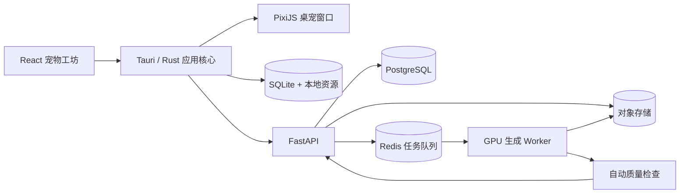

# Epet 桌面宠物产品与开发计划

> 文档版本：v0.2
> 首次编写：2026-07-23
> 最近更新：2026-07-24
> 当前状态：待评审
> 正式支持：Windows 11 x64
> 尽力兼容：Windows 10 22H2 x64 / ESU（不承诺跟随微软提供系统级安全支持）
> 推荐技术路线：Tauri 2 + React/TypeScript + PixiJS + Python/FastAPI + 云端 GPU

## 0. v0.2 已冻结的 MVP 决策

以下决策是后续设计、契约和排期的共同前提。需要改变时必须创建 ADR，并重新评估范围、成本和时间：

1. Windows 11 x64 是正式支持平台；Windows 10 22H2 x64 / ESU 只做尽力兼容。
2. 技术内测和公开 MVP 都只支持猫。
3. 输入为一张必选主照片和最多两张可选补充照片。
4. 客户端运行时只支持 Sprite Atlas；骨骼和形变只作为服务端内部制作手段。
5. AI 动作一致性不足时，MVP 直接采用“标准立绘 + 模板轻动画”，不继续扩张生成复杂度。
6. 产品形态是透明置顶悬浮窗口，不使用未文档化方式嵌入桌面图标层。
7. 匿名安装 ID 不是身份凭证；设备密钥、短期令牌和服务端资源归属校验共同完成匿名鉴权。
8. PostgreSQL 任务快照是状态事实来源；Redis 和 SSE 只负责实时通知。
9. 第 14 周目标是封闭 Alpha；公开 MVP 另设 2–4 周灰度期，并由真实指标决定是否放量。
10. Gate A–D 任一未通过时，只修复、降级或重新评审，不自动进入下一阶段。

## 1. 项目目标

Epet 的核心目标是让用户通过一张真实宠物主照片和最多两张可选补充照片，生成一个保留宠物主要外观特征、能够播放动画并长期悬浮显示在电脑桌面上的 2D 桌面宠物。

本文中的“桌面宠物”指位于普通应用窗口上方的透明悬浮窗口，不指嵌入壁纸层或桌面图标层。全屏、锁屏和系统安全界面下允许自动隐藏或暂停。

首版必须完成下面的完整闭环：

```text
打开软件
→ 上传宠物照片
→ 检查并裁剪照片
→ 生成标准宠物形象
→ 用户确认形象
→ 生成桌面动作
→ 预览
→ 点击“使用到桌面”
→ 宠物出现在桌面
→ 可拖动、互动、隐藏和重新唤出
```

项目不应把“生成一张好看的图片”当作最终结果。真正的交付物是一套可以被桌宠运行时加载的宠物资产，包括角色贴图、动作、锚点、碰撞区域、缩略图和资源清单。

## 2. 计划假设

为了让实施步骤足够明确，本计划先采用以下假设：

1. 首发正式支持 Windows 11 x64；Windows 10 22H2 x64 / ESU 仅尽力兼容；macOS 在 MVP 验证后处理。
2. 技术内测和公开 MVP 都只支持猫，狗在 v1.1 增加。
3. 首版只提供一种统一的卡通风格。
4. 同一时间只允许一只宠物显示在桌面。
5. 首版动作包括待机、走路、睡觉、点击反应和拖拽反应。
6. AI 生成在云端 GPU 上完成，客户端只负责照片预处理、上传、任务展示和宠物运行。
7. 首版运行时只支持 Sprite Atlas。骨骼、网格形变和插值只作为服务端制作中间帧的内部手段，最终统一烘焙为逐帧贴图。
8. 首版可以不要求用户注册账号，但匿名安装 ID 只用于标识，不作为身份凭证；设备另生成不可预测的本地密钥，并使用短期访问令牌。账号、云同步和付费在后续版本增加。
9. 以 3 人核心团队估算：1 名桌面端、1 名后端/AI、1 名产品设计兼测试。若由 1 人独立开发，时间需要相应延长。

如果上述假设改变，优先调整范围和时间，不应直接把额外需求塞入当前 MVP。

## 3. MVP 范围

### 3.1 必须实现

- 普通可视化主窗口。
- JPG、PNG、WebP 照片上传。
- 一张必选主照片和最多两张可选补充照片；补充照片用于提供侧面、尾巴或花纹信息。
- 图片旋转、裁剪、压缩、EXIF 清理和质量检查。
- 单只宠物检测和主体选择。
- 一种风格的标准宠物形象生成。
- 标准形象确认和重新生成。
- 待机、走路、睡觉、点击、拖拽动作；允许生成流水线降级为标准立绘加模板轻动画。
- 生成进度、失败原因和失败重试。
- 桌面宠物预览。
- 透明、无边框、置顶的桌宠窗口。
- 宠物拖动、缩放、隐藏、暂停和鼠标穿透模式。
- 系统托盘。
- 宠物资源本地保存和再次使用。
- 软件重启后恢复上次使用的宠物、位置和尺寸。
- 原始照片删除、保留期限说明和隐私设置。
- Windows 安装包、卸载和基础自动更新能力。
- 内置一个无需联网即可运行的测试宠物，云端不可用时仍能验证桌宠基本功能。

### 3.2 明确不进入首版

- 任意照片自动生成完整 Live2D 模型。
- 单张照片直接生成通用 3D 模型。
- 多只宠物同时在桌面活动。
- 狗和其他物种。
- AI 对话、语音和复杂人格系统。
- 饥饿、健康、货币等复杂养成系统。
- 用户社区、宠物市场和创作者平台。
- 跨设备云同步。
- Linux 正式支持。
- 用户自定义脚本和第三方插件。
- 外部 `.epet` 文件导入、音频资源和宠物包市场。

## 4. 成功标准

下面指标作为 MVP 的初始目标，完成技术验证后再根据实测调整：

### 4.1 产品指标

- 合格照片从上传到生成成功的比例不低于 85%。
- 生成成功后点击“使用到桌面”的比例不低于 70%。
- “上传 → 生成 → 使用到桌面”完整流程完成率不低于 65%。
- 生成结果的人工作用性评审通过率不低于 80%。
- 用户可以在不查看帮助文档的情况下完成首次生成。
- 合格照片首次生成的端到端耗时目标：P50 不超过 5 分钟，P95 不超过 12 分钟；完成 Spike 后按真实流水线校准。
- 从启动到激活首只宠物的完成时间和放弃步骤可被测量。
- 次日仍启动桌宠的测试用户比例达到 35% 作为封闭测试初始目标；样本不足 30 人时只记录趋势，不作发布结论。

### 4.2 性能指标

- 参考电脑暂定为 Windows 11、4 核 CPU、8 GB 内存、集成显卡、1080p、100% DPI；该电脑上冷启动主窗口 P95 不超过 3 秒。
- 宠物静止时客户端 CPU 平均占用目标低于 5%。
- 宠物运行时内存目标低于 250 MB。
- 动画正常情况下保持至少 30 FPS。
- 自主行走时移动系统窗口的更新频率不与动画帧率绑定；以不抖动、不抢焦点和 CPU 达标为准。
- 锁屏、睡眠、全屏应用或宠物长时间不可见时自动降帧或暂停。
- 单个宠物资源包建议控制在 30 MB 以内。

### 4.3 稳定性指标

- 无崩溃会话比例达到 99.5%。
- 网络中断后生成任务可以恢复查询，不重复扣减生成额度。
- 软件重启后不会丢失已经下载完成的宠物资源。
- 更新或卸载不会误删用户明确选择保留的宠物资源。
- 服务端每个阶段都有最大执行时间，任务不会永久停留在处理中。
- 磁盘空间不足、WebView2 不可用、GPU 渲染失败时给出可恢复提示，不静默退出。

### 4.4 成本和运营指标

- 记录每次成功生成的 GPU 秒数、对象存储、流量和自动重试成本。
- 在阶段 0 结束时给出单只宠物成功生成成本的估算区间。
- 服务端设置每日 GPU 预算、单安装 ID 每日额度、全局并发上限和紧急停止开关。
- 超出预算时停止创建新生成任务，但不影响已有宠物在本地运行，也不丢失已完成资源。

## 5. 产品形态和用户流程

### 5.1 软件由三个部分组成

1. **宠物工坊主窗口**
   - 上传、裁剪和检查照片。
   - 选择生成风格。
   - 展示生成进度和错误。
   - 预览宠物动作。
   - 管理已经生成的宠物。
   - 修改设置。

2. **桌面宠物窗口**
   - 透明、无边框、默认置顶。
   - 只加载宠物运行所需资源。
   - 负责动画、移动、拖动、点击互动和状态切换。
   - 主窗口关闭后仍可继续运行。

3. **系统托盘**
   - 打开宠物工坊。
   - 显示或隐藏宠物。
   - 切换交互模式和鼠标穿透模式。
   - 暂停动画。
   - 重置宠物位置。
   - 退出软件。

### 5.2 首次使用流程

1. 启动时显示简单介绍和照片要求。
2. 用户点击“创建宠物”。
3. 用户选择一张主照片；需要时再添加最多两张补充照片。客户端立即检查格式、尺寸和文件大小。
4. 客户端自动修正 EXIF 旋转并移除元数据。
5. 用户分别裁剪照片并确认同一只宠物主体；主照片必须包含清晰头部和尽可能完整的身体。
6. 系统检查是否只有一只宠物、主体是否完整、遮挡是否严重。
7. 不合格时给出具体原因，例如“尾巴被截断”或“照片过暗”，允许继续尝试或换图。
8. 用户确认隐私说明后上传；每张照片标记为 `primary`、`side` 或 `detail`。
9. 服务端生成一张标准角色立绘。
10. 用户确认立绘；如果不像，可以重试或更换照片。
11. 确认后生成动作资源。
12. 预览页依次播放待机、走路、睡觉和点击反应。
13. 用户设置名称和默认大小。
14. 用户点击“使用到桌面”。
15. 资源完整性校验通过后，桌宠窗口在当前屏幕右下区域显示宠物。
16. 主窗口隐藏到系统托盘。

### 5.3 失败恢复流程

- 上传失败：保留本地裁剪状态，允许继续上传。
- 任务排队：展示排队状态和预计阶段，不伪造百分比。
- 标准立绘失败：允许在不重新上传的情况下重试。
- 某个动作失败：只重新生成失败动作，不重复生成全部资源。
- 客户端退出：重启后根据任务 ID 恢复状态。
- 资源下载中断：支持断点续传或重新下载。
- 资源校验失败：删除损坏的临时文件并重新下载。
- 最终生成失败：保留明确错误码，并允许用户删除原始照片。
- 服务端不可用：允许用户继续使用内置宠物和已下载宠物，创建入口显示服务状态而不是无限加载。
- 匿名凭据丢失：本地已下载宠物仍可使用；明确提示无法继续访问旧云端任务，并提供本地清理说明。

## 6. 总体技术架构



### 6.1 桌面端

- 使用 Tauri 2 管理应用生命周期、窗口、托盘、文件系统和更新。
- 使用 React + TypeScript 实现宠物工坊。
- 使用 PixiJS 实现 Sprite 渲染、动画播放和简单特效。
- 使用 Rust 处理窗口坐标、DPI、多显示器、开机启动和需要原生实现的命中测试。
- 使用 SQLite 保存宠物索引、设置和生成任务状态。
- 宠物大文件保存在应用数据目录，SQLite 只保存索引和元数据。
- 主窗口和桌宠窗口使用不同的 Tauri capability；桌宠窗口默认不具备网络、对话框、任意文件读写和 Shell 权限。
- 桌宠动画保持 30 FPS 或按需降帧，系统窗口位置采用独立的低频更新循环，具体频率由阶段 0 实测决定。

### 6.2 服务端

- FastAPI 提供上传、生成、确认、查询、重试和删除接口。
- PostgreSQL 保存任务、上传记录、生成版本和资源索引。
- Redis 保存异步队列、分布式锁和实时事件通知；PostgreSQL 中的任务快照是状态事实来源。
- 对象存储保存短期原图、中间产物和最终宠物包。
- GPU Worker 负责抠图、特征提取、标准立绘、动作关键帧、后处理和质量检查。
- 使用 SSE 推送“状态已变化”通知；SSE 不承诺永久事件回放，客户端连接、重连或发现事件序号缺口时重新查询任务快照。

### 6.3 安全边界

- WebView 不直接获得任意文件系统权限，只通过定义明确的 Tauri Command 操作。
- 每个 Tauri Command 都校验调用窗口标签、输入 Schema、目标路径和允许的操作范围。
- 客户端不保存云端长期密钥。
- 首次启动生成随机设备密钥，优先保存在 Windows Credential Manager；匿名安装 ID 不作为认证秘密。
- 上传和下载使用短期签名 URL。
- `.epet` 宠物包首版只允许 JSON、PNG 和 WebP，禁止音频、脚本、HTML、SVG 和嵌套压缩包。
- 解包时检查压缩前后大小、压缩比、文件数量、单文件大小、扩展名、哈希和路径，拒绝绝对路径、`../`、符号链接和大小写冲突路径。
- 日志不得记录原始照片、签名 URL、访问令牌和用户输入的完整本地路径。

### 6.4 环境和发布边界

- 至少设置 `development`、`staging`、`production` 三套环境，数据库、对象存储、队列和密钥彼此隔离。
- 模型版本、工作流版本和客户端最低兼容版本都通过配置发布，不在生产环境直接手工修改。
- 生产发布必须支持功能开关：关闭新上传、关闭新生成、强制模板动画、关闭自动更新渠道。
- 数据库迁移遵循“先兼容旧代码、再发布新代码、最后清理旧字段”的顺序；不可逆迁移需要备份和恢复演练。
- 更新签名私钥与 Windows 代码签名凭据分开保管，只允许受控 CI 发布任务读取。

## 7. 推荐仓库结构

```text
Epet/
├── apps/
│   └── desktop/
│       ├── src/                    # React 主窗口和桌宠 WebView
│       ├── src-tauri/              # Rust、窗口、托盘、SQLite、更新
│       └── tests/
├── services/
│   ├── api/                        # FastAPI
│   └── worker/                     # AI 和资产处理 Worker
├── packages/
│   ├── contracts/                  # OpenAPI、JSON Schema、共享类型
│   ├── pet-runtime/                # 动画状态机和资源加载器
│   └── ui/                         # 可复用 UI 组件
├── assets/
│   ├── builtin-pet/                # 内置测试宠物
│   └── templates/                  # 动作、骨骼、姿态和打包模板
├── infra/
│   ├── docker/
│   └── deployment/
├── tests/
│   ├── fixtures/                   # 已脱敏测试照片
│   ├── contract/
│   └── e2e/
├── docs/
│   ├── architecture/
│   │   └── decisions/              # ADR：窗口、动画格式、身份、事件等关键决策
│   ├── privacy/
│   ├── product/
│   │   └── quality-rubric.md       # 生成质量人工评分标准
│   └── runbooks/
├── PLAN.md
└── README.md
```

根目录使用统一命令封装开发流程，例如：

- `dev:desktop`：启动桌面端。
- `dev:api`：启动 API。
- `dev:worker`：启动 Worker。
- `test`：运行不依赖 GPU 的全部测试。
- `test:e2e`：运行端到端测试。
- `lint`：检查 TypeScript、Rust 和 Python。
- `build:desktop`：构建 Windows 安装包。

## 8. 核心数据结构

### 8.1 宠物资源包

最终资源使用 `.epet` 扩展名，本质为受限制的压缩包。建议结构：

```text
pet.epet
├── manifest.json
├── thumbnail.webp
├── atlas/
│   ├── pet.webp
│   └── pet.json
└── license.json
```

`manifest.json` 示例：

```json
{
  "schema_version": 1,
  "package_version": "1.0.0",
  "min_runtime_version": "0.1.0",
  "pet_id": "pet_01J...",
  "name": "Mimi",
  "species": "cat",
  "renderer": "sprite_atlas",
  "created_at": "2026-07-24T00:00:00Z",
  "canvas": { "width": 512, "height": 512 },
  "atlas": {
    "image": "atlas/pet.webp",
    "data": "atlas/pet.json",
    "max_texture_size": 4096
  },
  "default_scale": 0.75,
  "anchors": {
    "foot": [0.5, 0.92],
    "drag": [0.5, 0.35]
  },
  "hitboxes": [
    { "id": "body", "shape": "ellipse", "x": 0.18, "y": 0.2, "w": 0.64, "h": 0.7 }
  ],
  "actions": {
    "idle": {
      "frames": ["idle_000", "idle_001"],
      "frame_duration_ms": [100, 100],
      "loop": true,
      "fallback": null
    },
    "walk": {
      "frames": ["walk_000", "walk_001"],
      "frame_duration_ms": [83, 83],
      "loop": true,
      "fallback": "idle"
    },
    "sleep": {
      "frames": ["sleep_000", "sleep_001"],
      "frame_duration_ms": [125, 125],
      "loop": true,
      "fallback": "idle"
    },
    "tap": {
      "frames": ["tap_000", "tap_001"],
      "frame_duration_ms": [83, 83],
      "loop": false,
      "next_action": "idle",
      "fallback": "idle"
    },
    "drag": {
      "frames": ["drag_000"],
      "frame_duration_ms": [100],
      "loop": true,
      "fallback": "idle"
    }
  },
  "generation": {
    "pipeline_version": "1.0.0",
    "template_version": "cat-a-1"
  },
  "files": [
    { "path": "thumbnail.webp", "size": 12345, "sha256": "..." },
    { "path": "atlas/pet.webp", "size": 1234567, "sha256": "..." },
    { "path": "atlas/pet.json", "size": 4567, "sha256": "..." },
    { "path": "license.json", "size": 567, "sha256": "..." }
  ]
}
```

坐标统一使用 0 到 1 的归一化坐标，避免资源分辨率变化后锚点失效。

资源协议实施规则：

1. `manifest.json` 和 Atlas JSON 都必须有独立 JSON Schema。
2. Atlas JSON 只保存帧矩形、旋转信息和原始尺寸；动作顺序与帧时长只由 manifest 定义，避免两个文件互相冲突。
3. 包外 API 返回整个 `.epet` 文件的大小和 SHA-256；manifest 中的 `files` 覆盖除 manifest 自身外的所有文件，避免循环哈希。
4. 运行时不认识某个可选动作时使用 `fallback`；`idle` 是必选动作，不能回退。
5. 首版单包限制暂定为：压缩后 30 MB、解压后 100 MB、最多 100 个文件、单文件不超过 32 MB、最大压缩比 20:1；Spike 后根据实测调整。
6. `license.json` 记录模板、字体、模型输出和用户使用权说明，不把第三方模型权重或测试素材打入宠物包。

### 8.2 本地数据库

首版至少包含以下表：

- `pets`
  - `id`
  - `name`
  - `species`
  - `thumbnail_path`
  - `package_path`
  - `package_hash`
  - `created_at`
  - `last_used_at`
  - `status`
- `generation_jobs`
  - `id`
  - `remote_job_id`
  - `stage`
  - `progress`
  - `error_code`
  - `last_event_id`
  - `device_credential_id`
  - `local_input_state`
  - `created_at`
  - `updated_at`
- `app_settings`
  - `key`
  - `value`
- `runtime_state`
  - `active_pet_id`
  - `monitor_id`
  - `x`
  - `y`
  - `scale`
  - `visible`
  - `click_through`
  - `paused`
  - `last_behavior_state`
  - `runtime_version`

数据库迁移必须带版本号；升级失败时保留旧数据库并给出可恢复错误，不直接重建。

### 8.3 服务端任务状态

生成任务以 PostgreSQL 快照为事实来源，使用明确的状态机：

```text
created
→ validating
→ generating_portrait
→ awaiting_portrait_confirmation
→ generating_actions
→ postprocessing
→ quality_check
→ packaging
→ ready
```

所有处理中状态都允许进入：

```text
failed / canceled / expired
```

每次状态变化记录阶段、时间、版本、错误码和是否可重试。客户端只根据状态机展示 UI，不根据文案猜测任务状态。

补充规则：

- 上传会话与生成任务是两个独立状态机，`uploading` 不放入生成任务。
- `awaiting_portrait_confirmation` 设置确认期限；到期先进入 `expired`，不自动消费 GPU 继续生成。
- `ready` 只代表云端资源已经打包；客户端完成下载、校验和原子入库后，本地任务才进入 `installed`。
- `canceled` 是请求已被服务端接受后的最终结果；正在执行且不能立即终止时先标记 `cancel_requested`。
- 每个任务快照包含单调递增的 `version`。客户端更新本地状态时只接受更高版本，防止乱序 SSE 覆盖新状态。

## 9. API 计划

### 9.0 匿名身份

- `POST /v1/devices/register`
  - 客户端提交本地生成的公钥、客户端版本和一次性注册随机数。
  - 服务端返回设备凭据 ID、短期访问令牌和刷新凭据。
- `POST /v1/devices/token`
  - 客户端用设备私钥签名服务端随机挑战，换取短期访问令牌。
  - 访问令牌只允许访问该设备创建的上传、任务和资源。

怎么做：

1. 客户端首次启动时在 Rust 侧生成随机设备密钥，不将私钥暴露给 WebView。
2. 私钥优先写入 Windows Credential Manager；不可用时使用操作系统用户目录下的受限文件，并给出诊断日志。
3. API 在每个资源查询中同时校验令牌主体和资源所属设备，不能只依赖不可预测 ID。
4. 额度限制组合使用设备、IP 风险、并发任务和服务端总预算，安装 ID 仅用于统计。
5. 重装导致私钥丢失时不提供弱口令找回；本地 UI 必须提前说明匿名模式下无法跨设备或重装恢复云端任务。

### 9.1 上传

- `POST /v1/uploads`
  - 创建上传会话。
  - 参数：照片角色 `primary | side | detail`、文件大小、MIME、SHA-256、客户端幂等键。
  - 返回上传 ID、短期签名 URL、允许的请求头、文件限制和过期时间。
- `POST /v1/uploads/{upload_id}/complete`
  - 通知服务端上传完成。
  - 服务端重新验证 MIME、尺寸、哈希和实际文件内容。
- `DELETE /v1/uploads/{upload_id}`
  - 删除原图和未完成的中间文件。

怎么做：

1. 客户端先在本地完成解码、旋转、裁剪、压缩和元数据清理，再计算最终上传文件的大小与 SHA-256。
2. 客户端分别为每张照片创建上传会话，主图必选，补充图最多两张且必须属于同一任务草稿。
3. 对象存储上传策略限制对象键、最大大小、Content-Type 和过期时间，客户端不能自行决定对象路径。
4. `complete` 接口从对象存储读取实际对象头并异步解码验证，校验通过后才把上传状态改为 `ready`。
5. 未完成上传按过期时间自动清理；删除接口立即吊销后续访问并异步删除对象。

### 9.2 生成

- `POST /v1/generations`
  - 参数：主上传 ID、可选补充上传 ID 列表、风格 ID、物种提示、客户端幂等键。
  - 返回生成任务 ID。
- `GET /v1/generations/{job_id}`
  - 查询当前状态、阶段进度、可恢复错误和预览地址。
- `GET /v1/generations/{job_id}/events`
  - SSE 状态变化通知流；事件包含任务 ID、快照版本、阶段和时间，不包含签名 URL。
- `POST /v1/generations/{job_id}/portrait/confirm`
  - 确认标准立绘并启动动作生成。
- `POST /v1/generations/{job_id}/portrait/regenerate`
  - 使用原照片重新生成标准立绘。
- `POST /v1/generations/{job_id}/actions/{action}/regenerate`
  - 只重做某个动作。
- `POST /v1/generations/{job_id}/cancel`
  - 尝试取消尚未执行或可安全停止的任务。
- `GET /v1/generations/{job_id}/artifact`
  - 返回短期签名下载地址、包大小和 SHA-256。
- `DELETE /v1/generations/{job_id}`
  - 删除任务及按策略允许删除的相关资源。

怎么做：

1. 创建任务前确认所有上传都属于当前设备、已验证完成、未过期，且恰好有一张主图。
2. 使用“设备 ID + 接口名 + 幂等键”建立唯一约束；相同键和相同请求体返回原结果，相同键但请求体不同返回冲突错误。
3. Portrait 确认使用任务当前 `version` 做乐观锁，重复确认返回相同结果，不重复投递动作任务。
4. 重做立绘和动作都检查剩余额度、最大尝试次数和任务状态；把每次尝试保存为不可变版本。
5. SSE 只通知客户端有新版本。首次连接、重连、版本跳号或 SSE 失败时调用 `GET` 获取完整快照。
6. Artifact 接口只在 `ready` 状态返回短期下载 URL；客户端下载到临时文件，校验包外 SHA-256 后再安全解包。
7. 删除接口先把任务标记为不可访问并撤销签名 URL，再异步删除对象；客户端可查询删除状态。

### 9.3 API 实现要求

- 创建和重试接口使用幂等键，防止网络重试重复创建收费任务。
- 幂等键保留时间不得短于客户端最大离线重试窗口，暂定 7 天。
- 错误返回稳定的机器错误码和可本地化的展示参数。
- 所有任务快照和事件包含单调递增版本字段。
- 下载前后都校验哈希。
- 限制每个设备凭据的并发任务数和每日生成次数，并增加服务端全局预算保护。
- API、客户端和 Worker 共享同一份 OpenAPI/JSON Schema 契约。
- 所有写接口设置请求大小、超时和速率限制；错误响应不泄露对象键、内部堆栈或其他用户资源是否存在。

## 10. 分阶段实施计划

整体按三人团队规划：14 周目标是可邀请 20–50 人使用的封闭 Alpha，不承诺第 14 周公开发布。阶段 0 选择模板轻动画后，公开 MVP 预计还需要 2–4 周灰度和修复；如果坚持独立生成五套动作，则必须重新估算，不沿用 14 周目标。

项目使用阶段门控制投入：

- Gate A：窗口可用。透明悬浮、命中测试、自主移动、多屏和不抢焦点达到阶段 0 标准。
- Gate B：生成可用。50–100 组正式评估中身份一致性达到门槛，或明确采用模板轻动画。
- Gate C：纵向闭环可用。一张真实照片可以生成、下载、校验并激活为桌宠。
- Gate D：发布可用。隐私删除、成本上限、更新回滚、兼容矩阵和崩溃率达到门槛。

某个 Gate 未通过时只允许继续修复验证或采用预先定义的降级方案，不并行扩展更多功能。

| 阶段 | 建议时间 | 核心结果 |
|---|---:|---|
| 阶段 0：关键技术验证 | 第 1–2 周 | 证明桌宠窗口和生成一致性可行 |
| 阶段 1：最小工程基础 | 第 1–2 周并行 | 仓库、Mock API、基础 CI 和决策记录可用 |
| 阶段 2：桌面壳 | 第 2–4 周 | 内置宠物可以稳定显示在桌面 |
| 阶段 3：宠物运行时 | 第 3–5 周 | 动画、状态、拖拽和资源包可用 |
| 阶段 4：宠物工坊 UI | 第 4–6 周 | 上传、进度、预览和宠物库可用 |
| 阶段 5：生成服务基础 | 第 4–7 周 | API、队列、存储和 Worker 可用 |
| 阶段 6：AI 资产流水线 | 第 6–10 周 | 照片可以稳定生成可运行宠物包 |
| 阶段 7：端到端集成 | 第 10–11 周 | 完整用户闭环打通 |
| 阶段 8：测试和加固 | 第 11–13 周 | 性能、兼容、安全达到发布门槛 |
| 阶段 9：封闭 Alpha | 第 14 周 | 签名安装包进入 20–50 人封闭测试 |
| 阶段 10：公开 MVP 灰度 | 另计 2–4 周 | 根据 Alpha 数据决定是否逐步公开 |

### 阶段 0：关键技术验证

#### 目标

在大规模开发前验证两个最高风险问题：

1. Windows 透明桌宠窗口是否能稳定悬浮、拖动、穿透、自主移动并且不抢焦点。
2. 同一只宠物能否生成外观一致的标准立绘和多个动作。

#### 步骤 0.1：桌宠窗口 Spike

要做什么：

- 创建最小 Tauri 2 应用。
- 创建一个普通窗口和一个透明桌宠窗口。
- 使用一张内置透明 PNG 或简单 Sprite 动画。
- 验证无边框、置顶、跳过任务栏、显示和隐藏。
- 验证 `WS_EX_TOOLWINDOW`、`WS_EX_NOACTIVATE`、置顶层级和 Alt-Tab 行为；记录哪些能力由 Tauri 提供、哪些需要原生 Win32。
- 验证主窗口关闭后托盘和桌宠仍然运行。

怎么做：

- 桌宠窗口先采用紧贴宠物尺寸的小窗口，降低透明区域阻挡鼠标的问题。
- 用 Tauri 窗口 API 实现置顶、位置和可见性。
- 用托盘菜单实现“显示宠物”“隐藏宠物”“退出”。
- 记录窗口坐标时同时记录显示器 ID 和 DPI 缩放。
- 建立两套自主移动原型：A 为每个动画帧移动系统窗口，B 为动画 30 FPS、系统窗口 10–20 Hz 独立移动。
- 用统一脚本分别采集静止、动画、移动时的 CPU、内存、GPU、位置抖动和输入焦点；以实测选择方案，不提前锁定更新频率。
- Windows 11 为正式验收平台；Windows 10 22H2 / ESU 只记录兼容结果和已知限制。

验收标准：

- Windows 11 上连续运行 8 小时无崩溃、持续内存增长和明显位置抖动；Windows 10 完成至少 2 小时兼容测试。
- 桌宠不出现在任务栏和 Alt-Tab 主列表中。
- 点击或自主移动不会抢走当前应用键盘焦点。
- 主窗口关闭后桌宠不退出。
- 拖动后位置可以持久化。
- 重启后宠物回到有效屏幕区域。

#### 步骤 0.2：鼠标交互 Spike

要做什么：

- 验证可交互模式和完全穿透模式。
- 验证透明像素区域是否会阻挡下面的窗口。
- 评估是否需要 Windows 原生命中测试。

怎么做：

- 基线方案使用 Tauri 的忽略鼠标事件能力切换整个桌宠窗口。
- 可交互模式下缩小窗口边界，使阻挡区域尽量接近宠物。
- 如果透明边角仍明显影响使用，实现 Windows `WM_NCHITTEST` 原生处理：碰撞区域外返回穿透，宠物碰撞区域内允许点击。
- 使用 Alpha Mask 生成粗略命中区域，但把命中测试频率和区域复杂度设上限；复杂逐像素读取不得阻塞窗口消息线程。
- 不使用未文档化的 WorkerW“塞进桌面图标层”方案。
- 全局快捷键注册失败时显示提示，并始终保留托盘退出穿透模式的入口。

验收标准：

- 用户可以从托盘切换交互和穿透。
- 穿透模式下可以正常点击宠物后方的窗口。
- 可交互模式下可以点击和拖动宠物。
- 模式切换不会造成窗口失焦、卡死或丢失位置。
- 右键菜单、拖拽和滚轮缩放只在命中宠物区域时触发。

#### 步骤 0.3：AI 一致性 Spike

要做什么：

- 准备至少 20 组已获授权的猫照片用于探索；Spike 通过后扩充到 50–100 组作为 Gate B 正式评估集。
- 从每张照片生成标准立绘，以及待机、走路、睡觉三个动作的关键帧。
- 评估脸部、花纹、体型、尾巴和耳朵的一致性。

怎么做：

- 固定一种风格、分辨率和背景。
- 先生成标准角色图，再以它作为所有动作的唯一身份参考。
- 使用固定姿态模板控制动作轮廓。
- 不独立生成动画的每一帧，只生成关键姿态，然后使用骨骼、网格形变或插值补足中间帧。
- 建立人工评分表，同时保留自动相似度和闪烁指标作为辅助。
- 评分表固定四类分数：身份特征、结构正确、动作稳定、整体可用；至少两名评审独立评分并记录分歧。
- 同时实现“标准立绘抠图 + 模板呼吸/眨眼/尾巴轻动画”基线，比较质量、成本和交付时间。

验收标准：

- 探索集至少 80% 的样例能产出可辨认是同一只宠物的三个动作；该结果只用于选择路线，不作为公开发布统计结论。
- Gate B 使用 50–100 组冻结评估集，整体可用率不低于 80%，且严重结构错误率不高于 5%。
- 动作间主色、主要花纹、耳型和尾型没有明显随机变化。
- 如果达不到门槛，MVP 自动降级为“标准立绘抠图 + 模板轻动画”，不阻塞桌面端发布。

#### 阶段出口

- 完成窗口技术记录和兼容性结果。
- 完成 AI 样例集、评分表和失败案例分类。
- 明确采用小窗口还是全屏 Overlay。
- 明确首版使用生成动作还是模板动作。
- 明确正式支持的 Windows 版本、窗口移动策略和原生窗口样式。
- 输出单只成功宠物的 P50/P95 生成时间、成本区间和主要失败类别。
- 为以上结论分别创建 ADR；Gate A 或 Gate B 未通过时不得进入完整云端和工坊开发。

### 阶段 1：工程基础

#### 步骤 1.1：初始化仓库

要做什么：

- 建立前述目录结构。
- 配置 Node、Rust 和 Python 版本。
- 添加格式化、静态检查、单元测试和提交检查。

怎么做：

- 前端使用统一的包管理器和锁文件。
- Python 使用锁定依赖的环境工具。
- Rust 提交 `Cargo.lock`。
- 提供 `.env.example`，真实密钥不进入仓库。
- README 写明 Windows 开发环境和一键启动方式。
- 提供 Mock API 和内置宠物，使没有 GPU、PostgreSQL 和对象存储的开发者也能调试完整桌面流程。
- 将阶段 0 的关键结论写入 `docs/architecture/decisions/ADR-xxxx-*.md`，每份 ADR 包含背景、候选方案、决策、代价和重新评审条件。

验收标准：

- 新开发者按照 README 可在 30 分钟内启动桌面端和 Mock API。
- 所有基础检查可以通过一个统一命令执行。
- 仓库不包含密钥、真实用户照片和大模型权重。

#### 步骤 1.2：建立 CI

要做什么：

- 每次提交运行 TypeScript、Rust、Python 的格式检查和测试。
- 构建不签名的 Windows 测试包。
- 生成测试报告和构建产物。

怎么做：

- 将快速检查和耗时测试分开。
- GPU 测试不放在普通 PR 流程中，改用每日或手动任务。
- 固定工具链版本，避免构建机器漂移。
- CI 分为 `fast-checks`、`desktop-build`、`api-integration`、`gpu-evaluation` 四类；PR 默认只运行前三类中的无 GPU 任务。
- 生产签名任务使用受保护分支和人工批准，普通 PR 构建绝不接触代码签名与更新签名私钥。
- 生成软件物料清单和依赖许可证清单，归档到每个发布产物。

验收标准：

- 干净检出可以重复构建。
- 任一语言的类型错误或测试失败都会阻止合并。
- 构建产物能够在干净的 Windows 测试机安装。

#### 步骤 1.3：定义共享契约

要做什么：

- 定义宠物包 Schema、任务状态、错误码和 API。
- 生成 TypeScript 和 Python 类型。

怎么做：

- API 以 OpenAPI 为事实来源。
- 宠物包使用单独 JSON Schema 并包含 `schema_version`。
- 所有破坏性变更必须提升版本并提供迁移策略。
- 契约仓库提供黄金样例：一个最小合法包、一个完整合法包和一组非法安全样例。

验收标准：

- 客户端、API 和 Worker 的契约测试通过。
- 无法通过 Schema 的宠物包不能进入本地宠物库。
- 旧版客户端遇到更高的 `min_runtime_version` 时显示升级提示，不尝试加载。

### 阶段 2：桌面壳

#### 步骤 2.1：多窗口和生命周期

要做什么：

- 实现主窗口、桌宠窗口和系统托盘。
- 定义关闭、隐藏、退出和再次打开的行为。

怎么做：

- 关闭主窗口默认隐藏到托盘，不结束后台进程。
- “退出”必须从托盘或设置中明确触发。
- 桌宠窗口崩溃时可单独重建，不要求重启整个应用。
- 使用单实例锁，第二次启动只唤醒已有主窗口。
- 明确处理四种事件：关闭主窗口、托盘退出、操作系统注销/关机、进程异常退出；只在托盘退出和系统退出时终止整个应用。
- 桌宠 WebView 创建失败时最多自动重建一次，继续失败则停用桌宠并显示诊断入口，避免无限崩溃循环。

验收标准：

- 重复启动不会出现多个托盘和多个宠物。
- 主窗口可以反复打开和关闭。
- 桌宠窗口异常销毁后能恢复。

#### 步骤 2.2：窗口位置和多显示器

要做什么：

- 获取所有显示器的工作区、DPI 和主屏信息。
- 保存并恢复宠物的位置。
- 处理显示器拔出、分辨率变化和 DPI 变化。

怎么做：

- 同时保存显示器标识、工作区宽高、DPI、宠物逻辑尺寸，以及宠物脚底锚点相对工作区的归一化坐标。
- 恢复时先检查目标显示器是否存在。
- 目标显示器仍存在时根据新工作区和 DPI 恢复；标识失效时按分辨率和相对位置匹配；仍无法匹配则移动到当前主屏右下安全区域。
- 移动范围使用工作区，不覆盖任务栏。
- 每次移动先在统一坐标模块完成逻辑像素、物理像素和工作区转换，React 层不自行换算坐标。
- 监听显示器热插拔、DPI 改变、任务栏位置变化和分辨率变化，并对连续事件做防抖。

验收标准：

- 100%、125%、150%、200% 缩放下位置正确。
- 双屏左右排列和上下排列下都能拖动。
- 拔掉外接显示器后宠物不会留在不可见区域。

#### 步骤 2.3：托盘和运行设置

要做什么：

- 添加打开工坊、显示/隐藏、穿透、暂停、重置位置、开机启动和退出。

怎么做：

- 菜单状态与实际运行状态双向同步。
- 开机启动默认关闭，由用户主动开启。
- 暂停后停止动画计时器和自主移动，保留当前画面。
- 全局快捷键默认不启用；用户开启穿透模式时可选择注册，冲突或注册失败不影响托盘恢复入口。
- 托盘菜单只发送领域命令，由 Rust 运行状态统一落库后再广播给主窗口和桌宠窗口，避免三个界面各自维护状态。

验收标准：

- 所有托盘操作在主窗口关闭时仍可用。
- 开机启动设置可撤销。
- 退出后无残留进程。

### 阶段 3：宠物运行时

#### 步骤 3.1：安全资源加载器

要做什么：

- 下载、校验、解包和加载 `.epet`。
- 处理版本不兼容、文件缺失和资源损坏。

怎么做：

- 先下载到临时目录。
- 校验总大小、SHA-256 和清单。
- 使用随机临时目录安全解包。
- 校验所有资源后再原子移动到正式目录。
- 失败时删除临时文件，不破坏已有版本。
- 开始前检查可用磁盘空间至少大于“压缩包大小 + 最大允许解压大小 + 安全余量”。
- 使用逐项流式解包，累计解压大小和文件数；任何一项超限立即终止。
- 正式目录使用内容哈希命名，数据库事务只在原子移动完成后更新；启动时清理过期临时目录。

验收标准：

- 修改任意资源字节后校验会失败。
- 路径穿越和超大压缩包测试会被拒绝。
- 更新宠物资源失败时仍可使用旧版本。

#### 步骤 3.2：PixiJS 渲染器

要做什么：

- 加载 Sprite Atlas。
- 播放循环和非循环动作。
- 支持缩放、翻转、透明度和简单阴影。

怎么做：

- 纹理只加载一次并复用。
- 左右行走优先水平翻转，不重复生成资源；不对称花纹在生成 QA 中单独检查。
- 所有动作共用脚底锚点，切换时保持落脚位置不跳动。
- 静止和遮挡时降低渲染频率。
- 解析 manifest 后先检查 `min_runtime_version`、必选 `idle`、帧引用、帧时长数组和 Atlas 边界，再创建纹理。
- Pixi ticker 只负责帧动画；自主行为计时与系统窗口移动使用独立时钟，避免窗口消息阻塞拖慢动作。
- WebGL 初始化失败或设备丢失时尝试重建一次；仍失败则显示静态首帧并记录脱敏错误。

验收标准：

- 动作切换无明显闪烁。
- 脚底位置稳定。
- 连续切换 500 次不产生明显内存增长。

#### 步骤 3.3：行为状态机

要做什么：

- 将宠物行为、显示状态、暂停状态和交互模式建模为可测试的状态与事件。
- 保证托盘、主窗口、桌宠输入和系统事件同时发生时仍得到唯一结果。

行为状态只描述当前动作：

```text
boot → idle ↔ walk → idle
             ↘ sleep
any → tap → idle
any → drag → drop → idle
```

运行模式与行为状态正交保存：

```text
visible / hidden
running / paused / system_suspended
interactive / click_through
```

怎么做：

- 事件优先级为：系统退出或休眠 > 隐藏或暂停 > 拖拽 > 点击反应 > 睡觉 > 走路 > 待机。
- 随机行为使用可配置时间范围，避免频繁打扰。
- 状态切换只由状态机负责，UI 和输入层发送事件，不直接播放动画。
- 保存可复现的调试随机种子，方便复现行为 Bug。
- 暂停时保存原行为状态和剩余时长；恢复时先检查资源和屏幕状态，再恢复或安全回到 `idle`。
- 为每次转换定义触发事件、守卫条件、进入动作、退出动作和最大持续时间，使用表驱动测试而不是在 UI 中堆叠条件判断。

验收标准：

- 不会出现拖拽中突然睡觉等非法切换。
- 每个状态都有超时和异常恢复路径。
- 状态机单元测试覆盖全部合法和非法转换。

#### 步骤 3.4：交互

要做什么：

- 点击反应、拖拽、右键菜单、滚轮缩放和穿透切换。

怎么做：

- 使用 manifest 中的碰撞区域判断是否点击到宠物。
- 拖拽过程中暂停自主移动。
- 松开时限制位置到当前工作区。
- 缩放设置最小值和最大值，并持久化。
- 提供全局快捷键作为“穿透后无法点击宠物”的恢复入口。
- 自主移动以脚底锚点为位置基准，按工作区边界计算目标；到达边缘时翻转方向或转入 idle，不允许直接瞬移。
- 拖拽捕获鼠标后才开始移动；失去捕获、窗口失焦或收到 Escape 时走统一取消路径。
- 缩放以脚底锚点固定为原则，缩放后重新限制到工作区，最小值和最大值由 manifest 默认值与应用全局限制共同决定。

验收标准：

- 快速点击、拖动、缩放不会导致宠物丢失。
- 穿透模式始终可以通过托盘或快捷键关闭。
- 右键菜单不会意外触发拖拽。

### 阶段 4：宠物工坊 UI

#### 步骤 4.1：页面和状态设计

要做什么：

实现以下页面：

- 首页 / 我的宠物。
- 创建宠物。
- 主照片与可选补充照片选择、裁剪和质量检查。
- 生成进度。
- 标准立绘确认。
- 动作预览。
- 宠物详情。
- 设置和隐私。

怎么做：

- 任务状态保存在本地数据库，不只存在 React 内存中。
- 页面刷新或软件重启后从本地和服务端恢复任务。
- 所有不可逆操作，例如删除宠物，要求明确确认。
- React 只维护页面临时状态；任务、宠物库、运行设置和设备凭据状态都通过 Rust Command 读取，避免 WebView 刷新丢失。
- 为每个页面定义加载、空数据、离线、可重试错误、不可重试错误和成功六类状态，并在设计稿中逐一验收。

验收标准：

- 任意生成阶段退出主窗口后都能恢复。
- 页面不会因网络短暂中断丢失任务。

#### 步骤 4.2：本地照片处理

要做什么：

- 格式验证、旋转、裁剪、尺寸压缩和 EXIF 清理。

怎么做：

- 解码图片内容，不只检查扩展名。
- 限制输入尺寸和文件大小。
- 默认最长边压缩到生成服务需要的尺寸。
- 上传前展示最终裁剪结果和预计上传大小。
- 临时文件在任务完成、取消或过期后清理。
- 处理顺序固定为：读取并解码 → 应用 EXIF 方向 → 转换为统一色彩空间 → 用户裁剪 → 缩放 → 重新编码 → 丢弃全部元数据 → 再次解码校验 → 计算哈希。
- 主图必须通过头部清晰、主体面积和身体完整度本地基础检查；补充图只要求可识别为同类宠物，最终同一性检查由服务端完成。
- 原文件只以只读方式打开；上传始终使用应用临时目录中的清理后副本。

验收标准：

- 超大图、损坏图、伪装扩展名和透明空图都有明确错误。
- 上传文件不包含 GPS 等 EXIF 信息。
- 裁剪后的方向与用户看到的一致。
- 多张照片角色标记正确，删除或替换补充图不会使主图草稿丢失。

#### 步骤 4.3：进度和预览

要做什么：

- 展示真实阶段：检查、排队、标准形象、等待确认、动作生成、打包。
- 展示可操作的失败信息。
- 播放最终动作预览。

怎么做：

- 使用 SSE 接收事件，并记录客户端已应用的最新任务快照版本。
- SSE 事件包含快照版本；首次连接、断线重连和发现版本跳号时调用 `GET` 获取完整任务快照，持续失败则改用带退避的低频轮询。
- 百分比只在服务端有真实子任务进度时显示，否则使用阶段状态。
- 预览使用与桌宠窗口相同的 `pet-runtime`，避免预览与桌面结果不一致。

验收标准：

- 断网 2 分钟后恢复，任务状态能够继续更新。
- 每一种服务端错误都有对应用户操作。
- 预览通过的资源可以直接被桌宠运行时加载。
- 客户端时钟不用于判断服务端任务是否过期，所有期限都显示服务端绝对时间并容忍本地时钟偏差。

#### 步骤 4.4：我的宠物

要做什么：

- 展示缩略图、名称、创建时间和当前使用状态。
- 支持使用、隐藏、重命名、删除和重新下载。

怎么做：

- 删除本地资源和删除云端任务分成两个明确选项。
- 删除正在使用的宠物前先停止桌宠。
- 资源丢失时显示“重新下载”，不显示为普通可用状态。
- 本地删除先把宠物从运行时停用，再在数据库事务中标记 `deleting`，移动资源到应用回收目录，最后异步清理；中途失败可恢复。
- 云端删除显示 `requested / processing / completed / failed`，不能在请求返回 202 后立即宣称已完全删除。

验收标准：

- 删除不会影响其他宠物。
- 当前宠物状态在主窗口、托盘和桌宠窗口中一致。

### 阶段 5：生成服务基础

#### 步骤 5.1：API、数据库和对象存储

要做什么：

- 实现上传、任务、事件、确认、重试、下载和删除接口。
- 建立 PostgreSQL 数据模型和迁移。

怎么做：

- 所有资源归属设备凭据 ID；安装 ID 只作为非敏感客户端标识。
- 数据库只保存对象键，不保存长期签名 URL。
- 上传对象、处理中间对象和最终对象使用不同前缀和保留策略。
- 删除操作记录审计事件，但审计日志不保留图片内容。
- 上传、任务、尝试、资源和删除请求分别建表，使用外键和状态约束防止孤儿记录。
- 先编写数据库迁移和 OpenAPI 契约，再实现 Repository、Service、Route 三层；路由层不直接操作对象存储或队列。
- 本地开发使用对象存储兼容服务和 CPU/Mock Worker；staging 使用与生产相同的对象生命周期策略。

验收标准：

- 用户 A 无法访问用户 B 的任务和资源。
- 重复提交同一幂等键只创建一个任务。
- 过期签名 URL 无法继续访问。
- 数据库迁移可以在 staging 从上一发布版本升级并回滚应用代码，旧客户端仍能完成已有任务。

#### 步骤 5.2：异步队列

要做什么：

- 将生成拆为可重试的独立步骤。
- 支持取消、超时、重试和死信队列。

怎么做：

- 每一步输入和输出都保存版本和对象键。
- 重试从失败步骤继续，不重复已成功且仍有效的步骤。
- 对模型超时、显存不足、输入不合格和内部错误使用不同策略。
- 单个任务设置最大自动重试次数和最大 GPU 时间。
- 每个队列消息只携带任务 ID、步骤名和期望任务版本，Worker 从数据库读取真实输入；消息中不放签名 URL和照片内容。
- Worker 领取任务时使用租约和心跳；租约过期后其他 Worker 才能接管。
- 步骤输出先写入带尝试 ID 的新对象，完成校验后用数据库事务提交为当前版本，不覆盖用户已确认版本。
- 为每类错误定义策略表：输入错误不重试、显存不足降低批量后重试一次、网络错误指数退避、未知错误进入死信队列。

验收标准：

- Worker 崩溃后任务能够被其他 Worker 接管。
- 同一步骤重复执行不会覆盖已确认的用户结果。
- 超过重试次数的任务进入可诊断的失败状态。
- 取消请求在步骤边界生效；不能安全中断的 GPU 调用结束后丢弃未提交结果，不继续后续步骤。

#### 步骤 5.3：事件和可观测性

要做什么：

- 记录阶段耗时、队列时间、GPU 时间、失败原因和成本。
- 提供 SSE 事件。

怎么做：

- 每个任务使用统一关联 ID。
- 日志、指标和追踪都携带任务 ID，但不携带原始照片。
- 统计每次成功生成的 GPU 秒数、存储和流量成本。
- 为队列积压、失败率和 GPU 不可用设置告警。
- 状态变化先在 PostgreSQL 事务中更新任务版本和事件摘要，再向 Redis 发布通知；Redis 丢消息不影响客户端通过 GET 获取最终状态。
- 指标按环境、模型版本、工作流版本和错误类别聚合；任何标签都不得包含宠物名、对象键或用户路径。
- 建立最小运行手册：队列积压、GPU 全部离线、对象存储故障、预算超限、删除积压各有确认步骤和恢复步骤。

验收标准：

- 可以从任务 ID 定位失败步骤和模型版本。
- 可以计算每个成功宠物的平均生成成本。
- SSE 断开不会影响后台任务执行。

### 阶段 6：AI 资产流水线

#### 步骤 6.1：照片质量门禁

要做什么：

- 检测宠物数量、主体面积、清晰度、亮度、遮挡和身体完整度。

怎么做：

- 先做通用图像检查，再做宠物检测和分割。
- 输出结构化结果，不只输出“合格/不合格”。
- 对可修复问题给出裁剪建议，对不可修复问题要求换图。
- 技术内测允许人工覆盖门禁，公开版本默认不允许明显不合格输入消耗 GPU。
- 多图任务先分别检测，再比较颜色、脸部和花纹特征是否可能属于同一只猫；低置信度时要求用户移除补充图，不直接合并矛盾信息。
- 所有阈值写入版本化配置并记录到任务，不把阈值散落在代码中。

验收标准：

- 测试集中明显模糊、主体过小、多人多宠物和严重截断样例能被识别。
- 误拒绝和误放行率有记录，并可按模型版本比较。

#### 步骤 6.2：抠图和宠物特征描述

要做什么：

- 生成干净的宠物 Alpha Mask。
- 提取可用于控制后续生成的 `pet_spec`。

`pet_spec` 至少包含：

- 物种和体型。
- 毛色主色和辅色。
- 主要花纹及位置。
- 耳型。
- 眼睛颜色。
- 鼻口特征。
- 尾巴长度和形态。
- 毛发长短。
- 可见饰品。
- 不确定或被遮挡的部位。

怎么做：

- 检测和分割结果保留置信度。
- Alpha 边缘使用毛发修边，避免白边和硬锯齿。
- 结构化特征和参考图共同输入生成模型，不只依赖文字描述。
- 被遮挡部位标记为“推断”，在 UI 中说明可能与真实宠物不同。
- 主图决定构图和身份，补充图只填补可见特征；冲突时优先主图并在 `pet_spec.uncertainties` 中记录。
- `pet_spec` 使用 JSON Schema，字段包含值、置信度、来源照片和是否推断，后续步骤不得用自由文本覆盖高置信度结构化特征。

验收标准：

- 测试照片在浅色和深色背景下均无明显背景残留。
- 主要毛色、耳型和花纹描述与人工标注基本一致。

#### 步骤 6.3：生成标准角色立绘

要做什么：

- 生成统一构图、统一姿势、透明或纯色背景的标准角色图。

怎么做：

- 使用固定画布、镜头、光线、风格和标准姿势。
- 将原照片、抠图结果、`pet_spec` 和风格模板作为条件。
- 保存模型版本、工作流版本和随机种子。
- 一次可以生成少量候选，但只让用户确认一个主版本。
- 用户确认后冻结身份参考，后续动作不得自行改变身份源。
- 候选数和免费重做次数由服务端配置；默认一次生成 2 个候选，最多免费重做 1 次，防止匿名生成成本失控。
- 将确认后的标准图、Mask、`pet_spec`、模型/工作流版本和随机种子组成不可变身份版本，所有动作尝试引用其 ID。

验收标准：

- 角色完整落在画布内。
- 没有多余肢体、严重残缺或背景污染。
- 人工评审能够从候选中识别原宠物的主要特征。

#### 步骤 6.4：动作模板和关键帧

要做什么：

- 为每种体型定义固定动作模板。
- 生成待机、走路、睡觉、点击和拖拽动作。

怎么做：

- MVP 只建立猫体型原型，例如短毛猫 A、长毛猫 B、幼猫 A；狗模板不进入本阶段。
- 每个模板定义画布、脚底线、身体关键点、动作关键姿态和碰撞区域。
- 使用已确认标准立绘作为身份参考，使用姿态图或轮廓作为动作约束。
- 只生成动作关键帧，采用骨骼、网格形变或受控插值生成中间帧。
- 待机动作优先使用呼吸、眨眼、尾巴摆动等局部变化，降低身份漂移。
- 走路动作要求脚底基线和循环首尾一致。
- 无论中间使用骨骼还是网格，最终动作都烘焙成 Sprite 帧，客户端不加载骨骼、模型权重或生成脚本。
- 优先实现模板轻动画基线：呼吸、眨眼、尾巴摆动和整体轻微位移；只有身份一致性 Gate B 通过后才启用生成式关键姿态。
- 每个动作生成后立即做局部 QA，失败动作不进入后续 Atlas；重做次数达到上限时使用 manifest 中的 fallback。

验收标准：

- 五种动作都可在统一画布和锚点下播放。
- 动作间脸型、毛色、花纹和身体比例无明显跳变。
- 动画循环首尾没有明显闪帧。

#### 步骤 6.5：后处理

要做什么：

- 统一透明边缘、色彩、尺寸、锚点、碰撞区域和帧率。
- 打包 Sprite Atlas。

怎么做：

- 对每帧执行 Alpha 修边、去背景色污染和边缘颜色扩展。
- 计算统一包围盒，并按模板对齐脚底锚点。
- 限制纹理最大尺寸，优先使用支持 Alpha 的 WebP 或 PNG。
- 合并图集时保留帧名、时长和动作标签。
- Atlas JSON 只保留帧几何信息，帧时长、顺序、循环和 fallback 写入 manifest。
- 生成缩略图、manifest、license 和文件哈希。
- 使用固定命名规则 `<action>_<index:03>`，按动作稳定排序，保证相同输入重复打包得到相同逻辑结构。
- 打包前运行 Schema、帧引用、纹理边界、限制值和许可证检查；打包后重新读取整个 `.epet` 做一次黑盒加载测试。

验收标准：

- 资源可以通过 JSON Schema 和桌宠资源加载器校验。
- 透明边缘在浅色和深色桌面上都没有明显光边。
- 资源包大小和纹理尺寸不超过配置限制。

#### 步骤 6.6：自动质量检查

要做什么：

检查项：

- 宠物身份相似度。
- 主要颜色和花纹漂移。
- 多肢体、缺肢体和轮廓破损。
- 动画闪烁。
- 循环接缝。
- 脚底滑动。
- 透明背景污染。
- 文件完整性。

怎么做：

- 自动检查作为筛选，不完全替代人工和用户预览。
- 为每项输出分数、阈值和失败原因。
- 失败时只重做对应动作或对应后处理步骤。
- 保存失败缩略图供开发排查，按隐私保留策略自动删除。
- 自动 QA 的阈值用冻结坏样例集校准；阈值修改必须生成版本并跑完整回归，不允许为单个生产任务临时放宽。
- 人工评分使用同一份 `quality-rubric.md`，记录评审者、流水线版本和分项得分；自动分数只用于筛选，不直接宣称“像同一只宠物”。

验收标准：

- 已知坏样例能够被稳定拦截。
- 质量检查不会无限重试。
- 用户看到的动作均已通过最低质量门槛。

### 阶段 7：端到端集成

#### 步骤 7.1：打通完整闭环

要做什么：

按真实用户路径执行：

1. 注册或恢复设备凭据。
2. 本地处理一张主图和可选补充图。
3. 为每张照片创建上传会话并上传。
4. 完成上传验证。
5. 创建生成任务。
6. 接收 SSE 通知并查询任务快照。
7. 确认标准立绘。
8. 等待动作和打包。
9. 下载 `.epet`。
10. 校验并原子加入宠物库。
11. 点击“使用到桌面”。
12. 桌宠窗口加载资源。

怎么做：

- 使用统一关联 ID 串起客户端日志、API 日志和 Worker 日志。
- 每一步都支持重复进入和幂等恢复。
- 只有宠物包完整校验并入库后才显示“使用到桌面”。
- 建立可控故障注入开关，在上传完成前、创建任务后、立绘确认前后、下载中和入库事务前分别模拟断网、进程退出和重复请求。
- 每次 E2E 使用新的设备测试凭据和独立对象前缀；测试结束通过正式删除 API 清理，验证清理过程本身。
- 使用 Mock Worker 跑每次 PR 的确定性 E2E，使用真实 GPU Worker 跑每日和发布候选 E2E。

验收标准：

- 20 次连续测试中至少 18 次无需人工干预完成完整流程。
- 在上传、生成、下载各阶段强制断网后都能恢复或明确失败。
- 重启客户端不会创建重复宠物或重复任务。
- 主图加两张补充图、只用主图、删除一张补充图后三条路径都能完成。

#### 步骤 7.2：删除和隐私闭环

要做什么：

- 支持删除本地照片、临时文件、宠物资源和云端任务。
- 落实保留期限。

怎么做：

- 原始照片默认在生成完成或任务终止后 24 小时内自动删除。
- 用户主动删除时立即使访问令牌失效，并异步清理对象。
- 默认不使用用户照片训练模型；未来如需使用必须单独明确授权。
- UI 展示“本地删除”和“云端删除”的区别。
- 为原图、中间产物、最终包、任务元数据、审计记录和备份分别定义保留期限；“删除完成”必须明确是否仍处于备份自然过期窗口。
- 删除 Worker 按对象清单逐项删除并记录非敏感结果；对象不存在视为幂等成功，临时故障进入有限重试和告警。
- staging 每周运行一次带测试对象的删除演练，生产每月抽查删除时延，只使用专用测试数据。

验收标准：

- 删除请求可查询完成状态。
- 保留策略有自动任务和监控。
- 隐私文档与实际系统行为一致。
- 用户可以看到删除请求状态、预计完成时间和备份最长过期时间。

### 阶段 8：测试和加固

#### 步骤 8.1：自动化测试

要做什么：

- 单元测试：状态机、坐标和 DPI 转换、manifest 解析、错误码映射、AI 后处理函数。
- 契约测试：OpenAPI、JSON Schema、SSE 事件版本。
- 集成测试：SQLite 迁移、上传下载、队列重试、对象删除。
- 端到端测试：上传到桌面、网络恢复、软件重启、资源损坏恢复。

怎么做：

1. 为纯函数和状态转换建立快速单元测试，PR 必须运行。
2. 用黄金合法包、截断包、哈希错误包、路径穿越包、压缩炸弹模拟包测试资源加载器。
3. 从 OpenAPI 生成客户端后启动临时 API 和数据库，验证真实请求与响应，不只比较静态文件。
4. 每个数据库版本准备“上一发布版本数据库”，执行升级、启动新应用、再用旧应用读取兼容字段。
5. Mock Worker 返回固定资源和可配置错误；E2E 通过参数选择超时、重试、取消、重复消息和乱序通知。
6. GPU 回归测试输出报告和样例索引，不阻塞普通 PR，但发布候选必须通过冻结评估集。

验收标准：

- 核心状态机和安全解包逻辑达到高覆盖。
- 每个已修复严重 Bug 至少增加一个回归测试。
- 发布分支所有非 GPU 自动化测试通过。

#### 步骤 8.2：Windows 兼容矩阵

要做什么：

至少覆盖：

- Windows 11 当前受支持版本，作为正式发布阻断项。
- Windows 10 22H2 / ESU，作为尽力兼容项并记录限制。
- 100%、125%、150%、200% DPI。
- 单屏、双屏和显示器热插拔。
- 集成显卡和独立显卡。
- 睡眠、唤醒、锁屏、切换用户。
- 全屏游戏或视频。
- 资源管理器重启。
- 安装、覆盖升级和卸载。

怎么做：

1. 建立虚拟机基础镜像和至少两台真实测试机，记录 OS Build、GPU、驱动、WebView2、DPI 和显示器布局。
2. 每个发布候选先跑 Windows 11 单屏自动化，再跑多屏、热插拔、睡眠唤醒和全屏人工测试。
3. Windows 10 发现问题时先判断是否影响安全或数据；安全和数据问题必须阻断兼容声明，纯视觉问题记录已知限制。
4. 测试任务栏位于上下左右、自动隐藏、Explorer 重启以及显示器主次切换。
5. 收集截图、事件日志和性能数据，测试结果写入发布候选报告，不使用“已测试”文字代替证据。

验收标准：

- 没有宠物永久跑到屏幕外。
- 没有窗口持续抢焦点。
- 不影响任务栏、输入法和常用办公软件点击。
- 睡眠唤醒后动画和托盘恢复。

#### 步骤 8.3：性能和稳定性

要做什么：

- 测量启动、空闲、动画、自主移动、拖拽、主窗口和后台任务的资源占用。
- 验证长时间运行、设备丢失和反复切换资源后的稳定性。

怎么做：

- 对空闲、待机、走路、拖拽和主窗口打开分别采样 CPU、内存和 GPU。
- 运行 8 小时稳定性测试。
- 模拟资源反复切换和窗口反复创建。
- 检查纹理、事件监听器、计时器和 WebView 是否泄漏。
- 全屏或锁屏时暂停不必要工作。
- 统一预热和采样规则：启动后等待 60 秒，每个场景采样至少 5 分钟，记录平均值、P95 和峰值。
- 参考机与一台低配机都运行；性能基线文件进入仓库，发布候选与上一稳定版自动比较。

验收标准：

- 达到第 4 节性能目标，或记录经过批准的新基线。
- 8 小时运行没有持续内存上升。
- 客户端异常退出后可以生成脱敏崩溃报告。

#### 步骤 8.4：安全检查

要做什么：

检查项：

- 文件类型伪装。
- 压缩炸弹。
- Zip Slip。
- 未授权任务访问。
- 签名 URL 泄露。
- 日志敏感信息。
- Tauri Command 权限过宽。
- WebView 内容注入。
- 依赖漏洞。
- 更新包签名。

怎么做：

1. 对所有 Tauri capability 和 Command 建立清单，逐项写明调用窗口、允许输入和文件范围。
2. 使用恶意文件语料测试上传解码与 `.epet` 解包，测试必须在资源受限环境中运行。
3. 对匿名鉴权执行越权测试：替换任务 ID、上传 ID、对象 ID、过期令牌和重放签名请求。
4. 在日志和崩溃报告中注入测试令牌、路径和签名 URL，验证脱敏器会移除。
5. 发布前运行依赖漏洞和许可证扫描；高危漏洞不能只通过忽略规则跳过，必须记录适用性判断。
6. 在干净虚拟机上篡改更新清单、安装包和签名，确认客户端拒绝安装。

验收标准：

- 高危问题全部关闭。
- 权限列表经过人工复核。
- 桌面端只加载本地受信内容，不加载任意远程网页。

### 阶段 9：封闭 Alpha

#### 步骤 9.1：发布准备

要做什么：

- 申请 Windows 代码签名证书。
- 制作安装包、卸载程序和更新清单。
- 编写隐私政策、用户协议、照片要求和故障帮助。
- 建立版本号和发布说明规则。
- 决定 WebView2 分发方式：在线 bootstrapper、离线 installer 或固定 Runtime，并记录安装包大小、离线能力与维护成本。
- 生成并备份 Tauri 更新签名密钥，明确私钥保管人、CI 使用方式、恢复演练和轮换方案。

怎么做：

- 发布包、更新包和清单都进行签名。
- 自动更新先进入灰度渠道，再进入稳定渠道。
- 安装包上传前在干净虚拟机测试。
- 卸载时询问是否保留本地宠物资源。
- 代码签名证书和更新签名私钥使用不同凭据；签名只在受保护 CI 环境完成。
- 先向内部渠道发布，再向 Alpha 渠道发布；客户端永远只从 HTTPS 固定域名查询更新。
- 在第 1–2 周启动证书申请和签名方案验证，不等到第 14 周处理。

验收标准：

- 干净 Windows 机器可安装、启动、升级和卸载。
- 签名可验证。
- 更新失败不会破坏当前可运行版本。
- 丢失网络、磁盘不足、更新签名错误和回滚到上一稳定版本都经过演练。

#### 步骤 9.2：封闭测试

要做什么：

建议先邀请 20–50 名用户，覆盖不同硬件和宠物照片。

观察指标：

- 上传合格率。
- 各生成阶段成功率和耗时。
- 用户在标准立绘阶段的重试次数。
- 每个动作的失败率。
- 下载和“使用到桌面”成功率。
- 客户端 CPU、内存、崩溃和窗口问题。
- 用户次日是否继续运行桌宠。

怎么做：

- 每周归类失败样例，区分输入问题、模型问题、后处理问题和客户端问题。
- 高成本重试前先优化失败最多的步骤。
- 仅收集完成产品改进所必需的脱敏数据。
- 每名测试用户绑定一个 Alpha 邀请额度，避免匿名接口被公开滥用；邀请标识只控制资格，不替代设备鉴权。
- 建立每周发布节奏：周初分类问题，中期修复与回归，周末发布候选；P0 立即关闭新生成入口。
- 反馈表把问题分为照片输入、身份相似、动作、窗口交互、性能、安装更新和隐私，不只收集自由文本。

验收标准：

- 无阻塞使用的 P0 Bug。
- P1 Bug 有明确规避方案和修复时间。
- 关键成功指标达到目标或已有经评审的调整结论。
- 隐私删除流程经过真实验证。

### 阶段 10：公开 MVP 灰度

#### 步骤 10.1：灰度决策

要做什么：

- 根据封闭 Alpha 的质量、稳定性、成本和隐私数据决定是否公开。
- 确定公开范围、每日名额、支持渠道和回滚条件。

怎么做：

1. 汇总至少两周 Alpha 数据，按客户端版本、流水线版本和硬件分层，不把不同版本混在一起计算。
2. 逐项检查 Gate D：P0、崩溃率、生成成功率、P95 时间、单只成本、删除时延和更新回滚。
3. 未达标项必须选择“修复后复审”“降低范围”或“停止发布”，不能仅修改指标使其通过。
4. 首批公开名额限制为每日固定数量，使用服务端开关逐步提高，不一次性取消预算和并发保护。

验收标准：

- 有书面发布决策、指标证据、负责人和回滚阈值。
- 客服、隐私请求、服务故障和更新失败都有可执行运行手册。

#### 步骤 10.2：逐步放量

要做什么：

- 按 5% → 20% → 50% → 100% 的顺序开放新版本或新生成额度。

怎么做：

1. 每个档位至少观察一个完整高峰周期，比较上一档的生成失败率、队列时间、崩溃率和成本。
2. 任何 P0、隐私删除故障、成本失控或客户端数据损坏立即停止放量；已有本地宠物继续运行。
3. 模型或工作流升级与客户端放量分开进行，避免同时改变两个主要变量。
4. 每次扩大范围前保存仪表盘快照和决策记录，发布后更新已知问题与用户帮助。

验收标准：

- 100% 放量后连续 7 天无 P0，关键指标未超过回滚阈值。
- 生成预算、队列容量和人工支持能力覆盖当前真实使用量。

## 11. 测试数据集计划

必须建立合法、可重复使用的内部测试集，不能依赖开发者临时从网络下载的未知授权图片。

数据集分三层：

- 探索集：20 组，用于阶段 0 快速发现方案问题，可以频繁查看和讨论。
- 冻结评估集：50–100 组，用于 Gate B 和发布候选对比；评估前冻结，不能针对单个样例调参。
- 坏样例安全集：至少 30 组，覆盖模糊、多宠物、严重截断、伪装格式、异常尺寸和错误补充图。

正式评估集应覆盖：

- 短毛猫、长毛猫。
- 浅色、深色、纯色和复杂花纹。
- 正面、侧面和轻微俯视。
- 简单背景和复杂背景。
- 不同光线和清晰度。
- 带项圈和不带项圈。
- 合格照片和故意准备的不合格照片。

每组数据包含：

- 使用授权记录。
- 宠物主体 Mask 或人工检查结果。
- 主要特征标注。
- 输入质量标签。
- 预期通过或拒绝原因。
- 每个流水线版本的输出和评分。

测试集不得进入客户端安装包，也不得用于生产日志展示。

怎么做：

1. 产品测试负责人建立素材登记表，记录授权人、授权范围、撤回方式、允许的环境和删除期限。
2. 原图放在受控测试存储中，仓库只保存不可逆样例 ID、标注和预期结果。
3. 两名标注者按统一评分表独立标注；分歧超过阈值时由第三人复核。
4. 每次流水线评估创建不可变运行记录，包含数据集版本、代码提交、模型、工作流、配置和随机种子。
5. 报告同时展示整体结果和长毛、深色、复杂花纹、遮挡等子集结果，防止总体平均掩盖明显短板。
6. 收到素材撤回请求时从后续数据集版本中移除，并按登记表删除已有测试输出。

## 12. 监控和埋点

### 12.1 客户端事件

- `app_started`
- `create_pet_started`
- `photo_selected`
- `photo_validation_failed`
- `upload_completed`
- `portrait_ready`
- `portrait_confirmed`
- `generation_failed`
- `pet_package_downloaded`
- `pet_activated`
- `pet_hidden`
- `click_through_changed`
- `client_crashed`

事件只包含必要的版本、阶段、错误码和性能数据，不包含照片、宠物名称和完整文件路径。

怎么做：

1. 所有事件先通过本地事件 Schema 校验和脱敏，再进入批量发送队列。
2. 崩溃报告、产品分析和运行日志分别设置用户开关；隐私说明列出用途和保留期限。
3. 离线事件设置最大数量和最大保留时间，超过限制丢弃最旧事件，不无限占用磁盘。
4. 开发环境使用调试接收端验证字段，生产环境拒绝未登记事件和自由文本属性。

### 12.2 服务端指标

- API 成功率和延迟。
- 上传失败率。
- 各任务阶段队列时间和执行时间。
- 各模型版本成功率。
- 自动重试次数。
- GPU 利用率和显存错误。
- 每个成功宠物的 GPU 成本。
- 原图和临时对象删除积压。
- SSE 连接数和断开率。

怎么做：

1. API、Worker 和删除任务使用同一关联 ID，指标只使用低基数字段。
2. 为成功生成定义统一成本公式，包含失败重试消耗，避免只计算最后一次成功 GPU 调用。
3. 仪表盘按环境和发布版本分开，staging 流量不得进入生产产品指标。
4. 每日生成预算达到 70%、90%、100% 时分别告警、限流和停止新任务。

### 12.3 告警

- 生成失败率突然升高。
- 队列等待超过阈值。
- GPU Worker 全部不可用。
- 删除任务积压。
- 对象存储或数据库错误。
- 新版本客户端崩溃率升高。

怎么做：

1. 每个告警指定严重级别、阈值、持续时间、负责人和运行手册链接。
2. 告警必须在 staging 人工触发一次，确认通知可达且运行手册有效。
3. 同一根因的重复告警聚合，恢复后发送恢复通知；禁止只有告警没有恢复条件。

## 13. 主要风险和降级方案

| 风险 | 早期信号 | 处理方式 | 降级方案 |
|---|---|---|---|
| 跨动作不像同一只宠物 | 花纹、脸型变化明显 | 标准立绘冻结身份、固定姿态、关键帧生成 | 只用标准立绘做模板轻动画 |
| 单张照片遮挡严重 | 尾巴、四肢无法判断 | 上传质量门禁，引导增加侧面照 | 明确标注隐藏部分为 AI 推断 |
| 透明窗口挡鼠标 | 用户无法点击后方软件 | 小窗口、碰撞区域、原生命中测试 | 提供完全穿透和全局快捷键 |
| 多屏和 DPI 错位 | 宠物跑到屏幕外 | 使用工作区和显示器感知坐标 | 重置到主屏安全位置 |
| 生成太慢或太贵 | 队列长、重试多 | 分阶段缓存、局部重做、限制重试 | 降低动作数或使用模板动作 |
| GPU 服务不可用 | 任务大量积压 | 多 Worker、超时和告警 | 暂停新任务并保留已上传状态 |
| 用户照片隐私争议 | 删除不及时、说明不清 | 最小化存储、短期保留、可验证删除 | 暂停上传功能直到修复 |
| 安装包被安全软件误报 | 下载或安装被拦截 | 代码签名、稳定更新源、减少高风险行为 | 提供已签名离线安装包 |
| Live2D/动作库授权问题 | 商用条款不明确 | 上线前完成许可审查 | 使用自研 Sprite 运行时和自有模板 |
| 常驻资源占用过高 | 风扇转、耗电明显 | 降帧、暂停、限制纹理 | 提供静态模式 |
| 匿名凭据丢失 | 重装后无法访问旧任务 | 首次使用时明确说明、本地资源独立保存 | 旧云端任务按保留策略自动过期 |
| 匿名接口被滥用 | 新设备和重试成本异常 | 设备凭据、邀请额度、IP 风险、全局预算 | 暂停新生成但保留本地运行 |
| Windows 10 生命周期结束 | 驱动和系统问题无法修复 | Windows 11 正式支持、Win10 只做兼容测试 | 移除 Win10 兼容声明 |
| 更新签名密钥丢失 | 已安装客户端无法验证新更新 | 离线备份、最小权限、恢复演练 | 发布迁移安装包并人工引导 |
| WebView2 安装失败 | 干净机器无法启动 | 选择明确分发模式并检测运行时 | 提供离线安装包或静态诊断页 |

## 14. 团队分工

### 桌面端负责人

- Tauri、Rust 和 Windows 窗口行为。
- React 宠物工坊。
- PixiJS 运行时。
- 本地数据库和资源管理。
- 安装、签名和自动更新。
- Windows capability、更新密钥流程和客户端脱敏。

### 后端/AI 负责人

- FastAPI、PostgreSQL、Redis 和对象存储。
- GPU Worker 和流水线。
- 模型适配、后处理和 QA。
- 隐私删除任务。
- 服务端监控和成本。
- 设备鉴权、预算保护、备份和删除运行手册。

### 产品设计/测试负责人

- 用户流程和 UI。
- 照片上传规则及错误文案。
- 测试集授权和标注。
- 生成结果人工评分。
- Windows 兼容测试。
- 封闭测试反馈和发布验收。
- 素材授权台账、隐私文档、评分量表和发布证据归档。

所有权不能只写“团队”。每个里程碑开始前，要为交付物、代码审查、验收和线上值守指定具体负责人。

## 15. Definition of Done

任何任务只有同时满足下列条件才算完成：

- 功能代码已合并。
- 有必要的单元测试或集成测试。
- 错误状态和恢复路径已实现。
- 日志不包含敏感信息。
- 文档和契约已同步更新。
- 已在目标 Windows 环境手工验证。
- 性能没有明显回退。
- 已与上一稳定版性能基线比较，并解释超过阈值的变化。
- 对用户可见的文案已经评审。
- 监控能够发现该功能的主要失败。
- 数据库、API、资源包或用户数据发生变化时，已经验证升级、失败恢复和回滚路径。
- 相关功能开关、预算限制和运行手册已经在 staging 演练。

## 16. 前两周可直接执行的任务清单

### 第 1–2 天

- [ ] 确认 Windows 11 正式支持、Windows 10 仅尽力兼容。
- [ ] 确认技术内测和公开 MVP 只支持猫。
- [ ] 确认唯一首发画风。
- [ ] 确认一张主图加最多两张补充图。
- [ ] 确认默认照片保留期限。
- [ ] 申请或选择 Windows 代码签名方案，生成并安全备份测试用更新签名密钥。
- [ ] 初始化最小仓库、工具链、Mock API 和 README。
- [ ] 创建只包含快速检查的基础 CI。

### 第 3–5 天

- [ ] 创建 Tauri 主窗口和透明桌宠窗口。
- [ ] 加入内置测试宠物。
- [ ] 完成置顶、隐藏和退出。
- [ ] 创建系统托盘。
- [ ] 完成基础拖拽和位置保存。
- [ ] 实现不抢焦点、跳过任务栏和 Alt-Tab 的原型。
- [ ] 建立两种自主移动窗口策略并采集性能。
- [ ] 在 Windows 11 不同 DPI 下正式测试，在 Windows 10 22H2 / ESU 做兼容测试。

### 第 6–7 天

- [ ] 实现交互和完全穿透切换。
- [ ] 评估透明区域原生命中测试。
- [ ] 实现单实例和主窗口隐藏到托盘。
- [ ] 记录桌宠窗口技术决策。
- [ ] 完成 Windows 11 八小时运行测试。
- [ ] 通过 Gate A，或记录阻断项和降级决策。

### 第 8–10 天

- [ ] 准备合法的 20 组 AI Spike 照片。
- [ ] 定义统一标准立绘和三个动作姿态。
- [ ] 同时制作模板轻动画基线和第一轮生成式动作。
- [ ] 建立身份一致性评分表。
- [ ] 记录 P50/P95 时间、单只成本和失败分类。
- [ ] 确定生成动作或模板轻动画的 MVP 决策，并写入 ADR。
- [ ] 规划 50–100 组冻结评估集；20 组探索结果不直接作为发布结论。
- [ ] 确认后续 12 周范围、人员和预算。

第一阶段最重要的交付不是漂亮的 UI，而是两个可以被验证的结果：

1. 内置宠物可以稳定显示在 Windows 桌面，并且不妨碍正常使用电脑。
2. 同一只真实宠物可以稳定地产出一张标准形象，并以可接受的一致性生成至少三个动作，或者模板轻动画基线已达到可接受质量。

只有这两点验证通过，才进入完整产品开发。

## 17. MVP 之后的迭代顺序

### v1.1

- 狗和对应体型、动作模板。
- 更多猫狗体型模板。
- 多种画风。
- 多显示器行为增强。
- 喂食、抚摸和简单亲密度。
- 单个动作重新生成。
- macOS 技术预览。

### v1.2

- 多宠物切换。
- 配饰和动作包。
- 日程提醒和轻量陪伴功能。
- 可选账号和云备份。

### v2

- AI 对话和宠物性格。
- 语音互动。
- 固定原型的高级 2D 骨骼或 Live2D 模板。
- 角色和动作市场。

### 暂不承诺

- 任意单图自动高质量 3D。
- 所有 Linux 桌面环境一致支持。
- 完全自动生成任意物种的通用骨骼。

## 18. 技术参考

- [Windows 10 Home and Pro 生命周期](https://learn.microsoft.com/en-us/lifecycle/products/windows-10-home-and-pro)
- [Windows Extended Window Styles](https://learn.microsoft.com/en-us/windows/win32/winmsg/extended-window-styles)
- [Tauri 2 Window Customization](https://v2.tauri.app/learn/window-customization/)
- [Tauri Core Window Permissions](https://v2.tauri.app/reference/acl/core-permissions/)
- [Tauri Capabilities for Different Windows](https://v2.tauri.app/learn/security/capabilities-for-windows-and-platforms/)
- [Tauri Tray API](https://v2.tauri.app/reference/javascript/api/namespacetray/)
- [Tauri Windows Installer / WebView2](https://v2.tauri.app/distribute/windows-installer/)
- [Tauri Updater](https://v2.tauri.app/plugin/updater/)
- [Electron BrowserWindow](https://www.electronjs.org/docs/latest/api/browser-window)
- [Live2D Material Separation](https://docs.live2d.com/en/cubism-editor-manual/divide-the-material/)
- [Live2D Cubism SDK for Web](https://docs.live2d.com/en/cubism-sdk-manual/cubism-sdk-for-web/)
