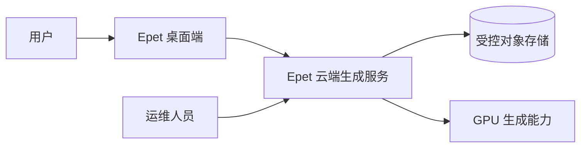
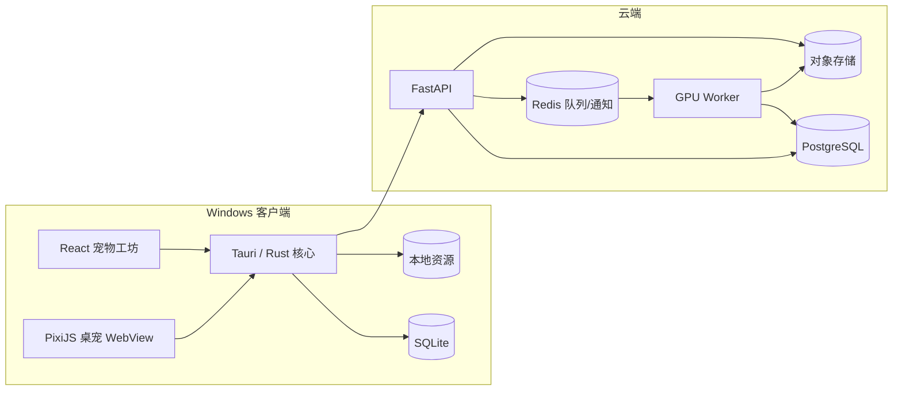

# 系统架构总览

> 状态：Active
> 负责人：技术负责人
> 评审人：桌面端负责人、后端/AI 负责人、安全负责人
> 最近更新：2026-07-24
> 更新触发：部署单元、状态所有权、信任边界或核心数据流变化

## 目的与范围

本文定义 MVP 的容器、职责、同步关系和故障边界。类、函数和具体云厂商不在本文范围，由模块设计和部署配置决定。

## 上下文

桌面端必须在云端不可用时继续运行内置宠物和已安装宠物。云端只负责设备凭据、上传、生成、资源分发与删除，不参与桌宠每一帧运行。

## 容器和职责

| 容器 | 拥有的职责 | 不拥有的职责 |
|---|---|---|
| React 工坊 | 页面临时状态、输入展示、生成流程 UI | 设备私钥、任意文件访问、任务事实 |
| PixiJS 桌宠 | Atlas 渲染、输入事件、视觉状态 | 网络、Shell、宠物包安装 |
| Tauri/Rust | 生命周期、窗口、托盘、凭据、本地数据库、安全文件操作 | AI 生成、云端任务调度 |
| FastAPI | 鉴权、资源归属、幂等、任务命令与快照查询 | 长任务执行、帧生成 |
| PostgreSQL | 任务、尝试、资源、删除请求的事实状态 | 实时推送和大文件内容 |
| Redis | 队列、租约协调、状态变化通知 | 永久任务事实与事件回放 |
| 对象存储 | 原图、中间产物和最终包 | 业务权限判定 |
| Worker | 版本化生成步骤、QA、打包与成本记录 | 对外鉴权与客户端 UI |

## 关键数据流

### 创建和生成

1. Rust 生成/恢复设备密钥，API 用挑战签名换发短期令牌。
2. 客户端只读打开照片，完成方向、色彩、裁剪、缩放、重编码、元数据清理和哈希。
3. API 创建受限上传会话；对象存储接收清理后的副本；API 再验证真实内容。
4. 创建任务时校验上传归属、角色、状态、额度与幂等键，并在 PostgreSQL 写入任务快照。
5. Worker 根据任务 ID 和期望版本读取输入，输出写入新的尝试对象，校验后事务提交。
6. Redis/SSE 只通知“版本变化”；客户端以 GET 快照补齐首次连接、重连或版本缺口。

### 安装和激活

1. API 仅在任务 `ready` 时返回短期下载地址、大小与包外 SHA-256。
2. Rust 下载到随机临时目录，流式检查压缩包、路径、文件数、大小、扩展名和 Schema。
3. 全部通过后按内容哈希原子移动至正式目录，再以 SQLite 事务登记。
4. `installed` 是客户端本地状态，不与服务端 `ready` 混用；只有已安装资源可被激活。

## 状态所有权

| 状态 | 事实来源 | 缓存/投影 |
|---|---|---|
| 云端生成任务 | PostgreSQL `generation_jobs` 快照 | Redis 通知、客户端 SQLite |
| 上传对象 | PostgreSQL 元数据 + 对象存储实际对象 | 客户端草稿 |
| 本地宠物库 | SQLite + 内容哈希目录 | React 页面 |
| 当前桌宠运行状态 | Rust 领域状态 + SQLite 持久化 | 托盘、主窗口、桌宠广播 |
| 页面临时输入 | React | 不跨重启承诺 |

所有任务快照带单调递增 `version`；消费者只接受更高版本。事件文案、百分比和客户端时间不能替代状态机。

## 环境与发布边界

- `development`、`staging`、`production` 的数据库、队列、存储和密钥完全隔离。
- 模型、工作流、阈值和最低客户端版本通过版本化配置发布。
- 数据库遵循 expand → migrate/use → contract，不可逆操作先备份和演练。
- 生产必须能独立关闭新上传、新生成、强制模板动画和自动更新渠道。

## 关键降级

- 云端故障：不创建新任务，已安装宠物正常运行。
- 生成动作质量不足：使用标准立绘加模板轻动画。
- SSE 故障：指数退避后低频轮询 PostgreSQL 快照投影。
- WebGL 失败：重建一次，仍失败显示静态首帧。
- 显示器/DPI 变化：按显示器、工作区与脚底归一化位置恢复，失败回主屏安全区。

## 验收

架构变更必须证明：状态只有一个事实来源、离线边界可控、权限不扩大、失败可恢复、现有客户端兼容，并同步 ADR、契约、测试和运行手册。
